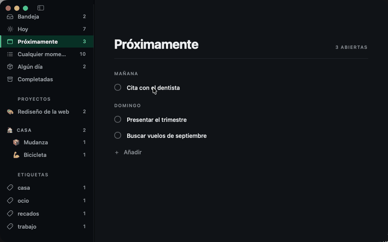

<div align="center">


<h1>Pauta</h1>

<p><strong>Gestor de tareas para macOS.</strong><br>
Nativo en SwiftUI, sin cuentas, sin suscripción<br>
y con tus datos en tu propia carpeta de iCloud.</p>

<p>


<a href="LICENSE"></a>
</p>

<p>
<a href="docs/ios.md"><strong>La app de iOS</strong></a>&nbsp; ·&nbsp;
<a href="docs/compilar.md"><strong>Compilar y firmar</strong></a>&nbsp; ·&nbsp;
<a href="docs/tecnica.md"><strong>Cómo se guarda y se sincroniza</strong></a>
</p>



<p><em>Arrastrar entre días: la fila que señalas dice dos cosas,<br>
la prioridad y el día.</em></p>

<p><sub>Hecho por <a href="https://github.com/jadrdev">@jadrdev</a></sub></p>

</div>

Pauta organiza el trabajo en dos ejes: **cuándo** y **de qué**. Una tarea entra
por la bandeja sin que tengas que decidir nada más que el título. Desde ahí le
pones fecha —y aparece en Hoy o en Próximamente—, la aparcas en Algún día, o la
metes en un proyecto.

Las listas de la barra lateral no son carpetas: son **consultas** sobre ese
estado. Una tarea con fecha de hoy y sin hora que pertenece a un proyecto sale a
la vez en Hoy, en Cualquier momento y en su proyecto, sin duplicarse. Cambiar su
fecha la mueve de lista sola.

## Las listas

| Lista | Qué contiene |
|---|---|
| Bandeja | Sin fecha, sin proyecto y sin aparcar: lo que aún no has decidido |
| Hoy | Planificadas para hoy o antes, más lo que tenga la **fecha límite encima**. Una tarea vencida sigue apareciendo aquí |
| Próximamente | Planificadas para más adelante, **agrupadas por día** |
| Cualquier momento | Lo que se puede hacer **cuando puedas**: lo de Hoy que no tiene hora, más las tareas de proyecto sin fecha. La bandeja queda fuera —lo que hay allí aún está sin decidir— y lo que tiene hora también: a las nueve no es cualquier momento |
| Algún día | Aparcadas a propósito, sin fecha |
| Completadas | Lo hecho, lo más reciente primero |

Los **proyectos** aparecen debajo, cada uno con su cuenta de tareas abiertas.

Una tarea de proyecto sin fecha sale en `Cualquier momento` a propósito: meterla
en un proyecto ya es decidir que se va a hacer, solo falta cuándo.

Y **lo que tiene hora no sale ahí**, aunque sea de hoy. La lista existe para
elegir qué hacer ahora, y una tarea de las nueve no se elige: se hace a las
nueve. Antes entraba todo lo de Hoy, con hora o sin ella, y una repetitiva
diaria a hora fija —la pastilla, el riego— reaparecía cada día en la única lista
que debería estar libre de horarios. Sigue saliendo en `Hoy`, que es donde la
columna del reloj significa algo.

Por lo mismo, **quitarle el día a una tarea le quita la hora**: una hora sin día
no dice cuándo. Ya pasaba al dejarla sin fecha y al aparcarla, y ahora también
al arrastrarla a la bandeja o a `Cualquier momento` — antes se quedaba con una
hora huérfana y desaparecía de la lista donde acababas de soltarla. Fuera de su
propio proyecto, cada tarea lleva el nombre del proyecto —con su emoji— en una
pastilla a la derecha, que es lo que permite distinguir dos tareas que se llamen
igual.

«Sin fecha» y «Algún día» son estados distintos, y esa distinción es el centro
del modelo: el primero significa «todavía no lo he decidido» y deja la tarea en
la bandeja; el segundo, «lo quiero hacer, pero no ahora». Por eso ponerle fecha
a una tarea aparcada la saca de Algún día — estar aparcada y con fecha a la vez
sería contradictorio.

<div align="center">

<p><em>La app sigue el tema del sistema.</em></p>
</div>

## Cómo se usa

| Atajo | Acción |
|---|---|
| `⌃Espacio` | [Alta rápida](#alta-rápida) a la bandeja, desde cualquier app |
| `⌘N` | Nueva tarea en la lista actual |
| `⌘⇧N` | Nuevo proyecto |
| `⌘⌥N` | Nueva área |
| `↩` | Guardar y seguir escribiendo otra tarea |
| `esc` | Cancelar la tarea nueva |
| `⌘⇧R` | Importar de Recordatorios |
| `⌘1` … `⌘6` | Bandeja / Hoy / Próximamente / Cualquier momento / Algún día / Completadas |
| `⌘0` | Volver a la ventana principal si se cerró |
| `⌘?` | Ayuda: los atajos y el estado de los permisos |
| `⌘,` | Ajustes |

Una tarea nueva nace ya encajada en la lista donde la creas: en Hoy sale con la
fecha de hoy, en Próximamente con la de mañana, en Algún día aparcada, y dentro
de un proyecto asignada a él.

Clic en una tarea la despliega para editar título, notas, fecha, repetición y
proyecto; se guarda mientras escribes, sin botón de guardar. El menú de fecha
tiene atajos para hoy, mañana y la semana que viene, y **«Otra fecha…» abre un
calendario** para cualquier día. El calendario es propio y no el `DatePicker`
gráfico del sistema, que traía su caja, su tipografía y su azul, y aquí se veía
diminuto y prestado. Este usa la paleta y los rótulos del resto de la interfaz,
marca hoy con un perfil y el día elegido con relleno, y siempre dibuja seis
semanas para que el panel no encoja al cambiar de mes. Clic derecho abre las acciones
rápidas: programar, aparcar o eliminar.

**Arrastrar** hace dos cosas según dónde sueltes:

- Sobre una **lista de la barra lateral**, mueve la tarea a esa lista. Como las
  listas son consultas y no carpetas, mover es cambiar lo que hace que la tarea
  caiga ahí: a `Hoy` le pone la fecha de hoy, a `Algún día` la aparca, a la
  bandeja le quita fecha y proyecto. Dos detalles: a `Próximamente` se respeta una
  fecha futura que ya tuviera en vez de adelantarla a mañana, y arrastrar una
  completada a una lista de pendientes la reabre — si no, iría a un sitio donde no
  se ve y parecería perdida.
- Sobre **otra tarea**, la coloca justo antes: es la prioridad manual. Una línea
  marca dónde va a caer. Soltar sobre «Añadir» la manda al final.
- Sobre una tarea **de otro día en `Próximamente`**, además le pone ese día. Esa
  lista está agrupada por fecha, así que la fila que señalas dice dos cosas y no
  una, y cambiar solo la prioridad hacía que el gesto pareciera no hacer nada:
  la tarea se quedaba donde estaba. También se puede soltar sobre el **rótulo del
  día**, que la manda a la cabeza de ese día.
- **Los proyectos también se arrastran entre ellos** para ordenar la barra
  lateral, y **sobre un área** para meterlos en ella. Sobre el rótulo
  `PROYECTOS` vuelven a quedarse sueltos.
- **Las áreas se arrastran entre ellas** para ordenarlas.

Una misma fila recibe cosas distintas, así que la señal cambia según lo que
lleves: **línea de inserción** cuando es reordenar entre iguales, y **la fila
entera encendida** cuando es meter algo dentro. Son gestos que caen en el mismo
sitio y no deben parecer el mismo.

Pasando el cursor por el rótulo `PROYECTOS` aparece **«A–Z»**, que ordena áreas
y proyectos alfabéticamente; también está en el menú contextual de cualquiera de
los dos. Es el alfabético del idioma, no el de los códigos: la ñ va tras la n y
los acentos cuentan como su letra. Los proyectos se ordenan **dentro de su
grupo**, que es como se leen. Solo aparece con el cursor encima porque ordenar
es algo que se hace de año en año.

### Áreas

Un área es un cajón de proyectos: «Casa», «Trabajo», «Estudios». Al pincharla
enseña **todo lo pendiente de sus proyectos**, con la pastilla del proyecto en
cada tarea para saber de dónde sale cada una.

Un área **no guarda tareas propias**. Lo que agrupa son proyectos, así que sin
proyecto no habría a qué colgarlas, y una tarea suelta dentro de un área sería
un segundo padre con sus propias reglas en un modelo que ya tiene uno. Por eso
estando en un área no aparece el botón de añadir y `⌘N` crea en la bandeja, que
es donde va lo que aún no está decidido.

Borrar un área **no borra sus proyectos**: los deja sueltos. Agrupar no es
contener, y perder el trabajo de dentro por tirar el cajón sería una pérdida
difícil de deshacer.

El rótulo `PROYECTOS` se muestra aunque no haya ninguno suelto: es el sitio
donde se sueltan para sacarlos de un área, y sin él no habría forma de sacarlos
arrastrando.

La prioridad es **una sola para toda la app**, no una por lista: las listas son
consultas sobre la misma tarea, así que su prioridad es intrínseca y todas la
respetan. En `Próximamente` manda el día, y el orden manual solo ordena dentro de
cada día.

Pegar un texto de varias líneas en el campo de nueva tarea **pregunta qué
quieres**: tantas tareas como líneas, o una sola tarea con el resto como pasos.
Las dos lecturas son razonables y ninguna es obviamente la buena, así que decidir
por ti acertaría la mitad de las veces. En ambos casos se quitan las viñetas
(`*`, `-`, `•`) y la numeración.

### Los eventos del día

<div align="center">

</div>

`Hoy` enseña también **los eventos de tu calendario**, para que sea el día
completo y no solo la lista de tareas: lo que hay que hacer y lo que ya está
comprometido, en el orden en que va a ocurrir. Lo de todo el día enmarca la
jornada y va arriba; después, todo lo que tiene hora —da igual si es un evento o
una tarea— y por último lo que no tiene hora, en su orden manual. Un evento ya
terminado se apaga: sigue siendo parte del día, pero ya no pide nada.

Se leen y no se tocan: sin casilla, sin arrastre y sin editor. La casilla es la
promesa de que algo se puede completar, y un evento no se completa — se pasa. La
franja de color es la del calendario del que viene, que es como se distingue de
un vistazo el trabajo de lo demás.

**Los eventos no entran en el `Store`.** Si entraran, acabarían escritos en la
carpeta como copias del calendario de verdad, y dos copias de lo mismo terminan
discrepando: se edita el evento fuera y aquí queda la versión vieja para
siempre. La fuente es el calendario; esto es lo que se lee de él cada vez, y se
relee solo cuando el sistema avisa de que algo cambió. Tampoco se hace al revés
—escribir las tareas de Pauta como eventos—: duplicaría cada tarea en dos sitios
que se editan por separado y hay que reconciliar.

El permiso se ofrece **una vez**, con una línea discreta en `Hoy`. Si dices que
no, no se vuelve a preguntar desde ahí; queda el comando *Eventos del
calendario…*, que lleva a los ajustes del sistema. Y no se cuentan como tareas:
el rótulo dice «4 EVENTOS · 7 ABIERTAS», porque un evento no es algo que hacer.

```bash
./build/Pauta.app/Contents/MacOS/Pauta --eventos
```

### Lo que no se hizo a tiempo

Nada se pierde ni se queda atrás: una tarea planificada para un día que ya pasó
**sigue en `Hoy`**, día tras día, hasta que se haga o se replanifique. No se
mueve sola a hoy, porque su fecha original es información: dice cuánto llevas
arrastrándola.

Y lo dice: junto a la tarea aparece **el día para el que se planificó**, en gris
y con un icono de reloj. Sin eso, algo de hace tres días se leería igual que
algo de esta mañana. Va en gris y no en rojo a propósito — el rojo es de las
fechas límite, que son lo que de verdad aprieta; si todo gritara, nada diría
nada.

Lo atrasado **insiste**: vuelve a avisar a su hora, hoy mismo si aún no ha
llegado y mañana si ya pasó, y así cada día hasta que se haga. El aviso dice
desde cuándo —«Pendiente desde el 31 de agosto»— con la fecha escrita entera y
no «hace tres días», porque se escribe hoy y puede sonar mañana. Completarla es
lo único que lo calla, que es la única forma sensata de callarlo.

Solo insiste lo de hoy y lo atrasado. Una tarea de la semana que viene avisa el
día que le toca, no todos los días desde hoy.

Con las repetitivas hay una trampa. La siguiente se cuenta desde la fecha que
tenía, no desde hoy, para que una semanal completada con un día de retraso siga
cayendo en su día de la semana. Pero además **se avanza hasta pasar de hoy**: si
no, completar una diaria con tres días de retraso pariría una sucesora ya
vencida, y habría que completarla tantas veces como días de retraso llevara solo
para ponerse al día — la app pidiendo cuentas por unos días que ya pasaron. Y si
la serie terminó mientras la tarea estaba atrasada, no nace ninguna: ponerse al
día no revive una serie acabada.

### La hora

Toda fecha en Pauta es **un día**, normalizado a las 00:00; la hora es lo único
que mira el reloj. Se pone desde el propio menú de fecha —`Hora ▸`—, no desde un
control aparte: una hora sin día no significa nada, así que ponérsela a algo sin
fecha lo programa para hoy, y quitarle la fecha o aparcarlo se lleva la hora.

Va en un campo aparte y **no dentro de `when`**. `when` es un día y hay quince
sitios que lo normalizan para comparar, agrupar y ordenar; meterle una hora
dentro le daría dos significados al mismo campo, y la cuenta de la repetición
—que devuelve el arranque del día siguiente— la perdería en silencio. Un campo
aparte no se puede perder sin que se note.

En `Hoy` y en cada día de `Próximamente`, **lo que tiene hora va primero y por
hora**; debajo sigue mandando el orden manual. La hora gana a la prioridad
porque no es una preferencia sino una restricción de fuera: no puedes decidir
que las nueve van después de las seis. En un proyecto o en la bandeja no se
aplica, que ahí comparar horas de días distintos no diría nada.

Una repetitiva **hereda la hora** —y el margen, y las etiquetas, y los pasos,
estos sin marcar—: «todos los días a las nueve» exige que la segunda vuelta
también sean las nueve.

#### El margen

`Hora ▸ Avisar antes` adelanta el aviso 5, 10, 15, 30 o 60 minutos. Avisar a la
hora exacta llega tarde para casi todo: hay que cerrar lo que estabas haciendo,
moverte, prepararte. Con margen, el aviso dice «prepárate» en vez de «ya se te
pasó».

Adelanta **el aviso y no la tarea**: las nueve siguen siendo las nueve en la
lista, en el orden y en la cuenta atrás. Si se movieran las dos cosas, el margen
no serviría de nada.

El margen se ve en la fila —una campana junto a la hora— porque si no, el aviso
llegaría antes de la hora escrita y parecería que la hora está mal. Y solo se
manda **un aviso**, el adelantado: dos por tarea sería el doble de ruido para
decir lo mismo, y el tope de 60 se gastaría al doble de velocidad.

Un margen que se sale del día avisa la noche anterior —diez minutos antes de las
0:05 son las 23:55 de ayer—, que es cuando de verdad hay que enterarse.

#### El aviso

Una hora sin aviso sería una etiqueta, así que las tareas con hora avisan por el
sistema. El permiso se pide **la primera vez que hay algo que avisar**, no al
arrancar: quien no use horas no tiene por qué ver el diálogo. Si lo rechazas, la
hora sigue funcionando como orden y como rótulo, solo que muda.

Los avisos se **reconstruyen enteros** con cada cambio, en vez de irse añadiendo
y quitando uno a uno. Es más trabajo por cambio y muchísimo menos que razonar
sobre qué aviso quedó suelto de una tarea que se completó, cambió de día, se
borró o llegó de otro dispositivo. Se reprograma un segundo después del último
cambio, porque escribir un título cambia las tareas en cada tecla.

Hay un tope de **60**: el sistema descarta lo que pase de 64 por app, y sin tope
propio se perderían avisos sin decirlo. Se quedan los más cercanos, y el
[repaso](#el-repaso-del-día) ocupa uno de los sesenta cuando está encendido.

Es la API vigente, `UNUserNotificationCenter` — `NSUserNotification` está obsoleta
desde macOS 11 —, y con **tres disparadores distintos** según lo que haya que
hacer:

| Cuándo | Disparador |
|---|---|
| Algo de más adelante | Calendario con fecha completa, una sola vez |
| Algo de hoy o atrasado | Calendario de hora y minuto, **repitiendo** cada día |
| Algo [aplazado](#aplazar) | Por intervalo, una sola vez |

La repetición es de la **insistencia** y nunca de la serie repetitiva. Una serie
avanza creando la sucesora al completar la anterior, y esa trae su propio aviso;
un disparador repetitivo atado a la serie seguiría sonando cuando la serie ya
hubiera acabado.

Hay un delegado, y hace falta para dos cosas que sin él no ocurren:

- **El aviso se ve aunque Pauta esté delante.** El sistema lo silencia por
  defecto dando por hecho que ya estás mirando la app, y en una app de tareas ese
  es justo el momento en que más falta hace.
- **Pulsarlo abre la tarea**, en una lista donde se vea; y trae dos botones,
  **«Completar»** para despachar una rutina sin abrir nada y **«Aplazar»**, con
  los minutos que digan los [ajustes](#ajustes).

Y si el permiso está denegado, **la app lo dice**: una franja arriba de la lista,
con un atajo a los ajustes del sistema. Un aviso que no llega y se calla es peor
que no tener avisos, porque la tarea parece cubierta y no lo está.

#### Aplazar

Un aviso que llega en mal momento se descarta, y el descarte se lo lleva hasta
mañana. El botón **«Aplazar 10 min»** es la salida que evita eso, y está también
en el menú contextual de la fila, porque «ahora no puedo» se piensa igual mirando
la lista.

Diez minutos y no una hora: lo bastante para terminar lo que tenías entre manos y
lo bastante poco para que aplazar no sea otra forma de perderlo de vista.

Aplazar **no toca la hora de la tarea**. Si la moviera, cada aplazamiento
reescribiría el horario y una rutina de las nueve acabaría a las once sin que
nadie lo decidiera. Se guarda como un instante aparte, que gana al horario
mientras dure y lo devuelve en cuanto se cumple.

Se guarda en el archivo y no solo en el centro de notificaciones, por dos
razones: sobrevive a cerrar la app, y **la fila puede decirlo** —una luna con la
hora—. Un aplazamiento invisible sería una tarea callada hasta las y cuarto sin
que nada explicara por qué.

Cambiar el plan lo borra: mover el día, mover la hora, aparcar o completar. Ese
«ahora no» hablaba de otro momento.

Y a diferencia del aviso de una tarea atrasada, **no insiste**: suena una vez.
Por eso va por intervalo y no por calendario —un disparador de calendario se
cuenta al minuto, y aplazar diez minutos a las y media y treinta segundos daría
un momento ya pasado, que no suena nunca—.

Completar o aplazar desde el aviso **reprograma al momento**, sin esperar al
disparador que vigila los cambios: ese vive en la ventana principal, y un aviso
se atiende con la ventana cerrada. Sin eso, completar dejaría la insistencia
sonando y aplazar no volvería nunca.

```bash
./build/Pauta.app/Contents/MacOS/Pauta --avisos
```

#### El repaso del día

Un aviso a hora fija —**8:30** por defecto— que dice qué quedó sin hacer:

```
Repaso del día
2 sin hacer de días pasados · 1 para hoy · 4 paradas desde hace semanas
```

Existe porque nada te lo cuenta si no abres la app, y antes, si no te acuerdas
de abrirla. Ese «acordarse» es justo lo que una app de tareas no puede pedir.

No es un aviso de tarea: no lleva una dentro, no se completa y no trae
«Aplazar» —aplazar el repaso solo sería aplazar la decisión, que es lo contrario
de para lo que existe—. Al pulsarlo se abre `Hoy`, que es donde se decide el día.

**Se programa uno solo y sin repetición**, aunque sea diario. El texto lleva las
cuentas dentro, y un disparador repetitivo seguiría cantando las de hoy dentro
de un mes. El siguiente se programa en cuanto algo cambia o cambia el día, que es
lo que mantiene el texto verdadero. Y las cuentas se hacen **para el día del
repaso** y no para hoy: el aviso se prepara la noche antes, y contar desde ese
momento llamaría «de hoy» a algo que por la mañana ya será de ayer.

Si no hay nada que decir, no suena. Un repaso que dice «nada» enseña a ignorar
los repasos, y de ahí a ignorar los demás avisos hay un paso.

La hora se elige en los [ajustes](#ajustes) —de 7:00 a 10:00— y se puede
**desactivar**: un repaso a una hora que no te sirve es un aviso que se aprende
a ignorar. Apagarlo se guarda como decisión y no como ausencia de dato, porque si
no, duraría hasta el siguiente arranque.

```bash
./build/Pauta.app/Contents/MacOS/Pauta --avisos
# permiso de avisos: authorized
# avisos programados: 3
# repaso del día: a las 8:30 (programado)
# botones de «tarea»: Completar, Aplazar 10 min
# avisos entregados y sin descartar: 1
```

Y para comprobarlo de punta a punta hay que hacer sonar uno:

```bash
./build/Pauta.app/Contents/MacOS/Pauta --seed-alarm 12 10
# tarea: CF52FCCE-…
# hora: 13:46  ·  aviso 10 min antes
# suena: 13:36:00
# para borrarla: rm '…/Pauta/items/CF52FCCE-….json'
```

Crea una tarea con hora dentro de esos minutos, con el margen que se le diga.
Escribe en los datos de verdad a propósito —un aviso solo se puede probar
sonando— y dice el comando para borrarla, porque una tarea de prueba que se
queda es basura.

Dice lo **programado** y lo **entregado**, que no es lo mismo: lo primero es lo
que va a pasar y lo segundo lo que pasó. Sin lo segundo, «probar los avisos» era
mirar el código y confiar. Y los botones se leen del sistema, porque que estén
escritos en el código no significa que estén registrados.

### Cuidado con leer permisos desde el terminal

`--eventos` y `--reminders-status` **mienten cuando se lanzan a mano**, y lo
dicen. TCC no atribuye el permiso al binario que pregunta sino al *proceso
responsable*, que ejecutando el ejecutable desde una shell es el terminal: lo que
sale es el permiso del terminal, no el de Pauta. Pueden discrepar —y discrepan—
sin que ninguno esté roto. El estado de verdad se ve en `Ayuda ▸ Permisos`, que
corre dentro de la app. Los avisos no van por TCC y sí se leen bien desde
cualquier sitio.

### Listas de comprobación

Una tarea puede llevar pasos. Se ven al desplegarla, y en la fila cerrada aparece
la cuenta —`1/3`—, que se pone en verde solo cuando está entera: si toda cuenta
gritara, ninguna diría nada.

Son **pasos, no subtareas**: no tienen fecha, ni proyecto, ni prioridad propia.
Lo que se planifica sigue siendo la tarea; los pasos solo dicen por dónde va. Por
eso completar la tarea no los marca —si la reabres, la lista sigue donde estaba—
y vaciar el texto de un paso lo borra, porque un paso sin texto no dice nada.

El campo «Añadir paso» está siempre mientras la fila esté abierta: es lo que hace
descubrible que una tarea puede ser una lista.

### Etiquetas

Transversales a todo lo demás: una tarea puede llevar varias, y cada una es una
lista más en la barra lateral. Soltar una tarea sobre una etiqueta **se la añade
sin quitarle las otras** — a diferencia de las listas, las etiquetas no son
excluyentes. Una tarea creada dentro de una etiqueta nace con ella puesta.

`Casa` y `casa` son la misma, y los espacios de sobra se recortan. En cada fila
solo se muestran las etiquetas que la lista no da ya por sabidas: dentro de
`casa`, esa no se repite en cada línea.

Las etiquetas **salen de las tareas**, no de una lista aparte: existen mientras
algo pendiente las lleve, así que no quedan huérfanas que limpiar. El precio es
que renombrar una toca todas las tareas que la llevan; a cambio no hay una
entidad más que mantener viva. Renombrar y quitar están en su menú contextual.

Cada proyecto puede llevar un emoji: se elige pulsando el círculo junto a su
título, de una paleta corta, y sustituye a su símbolo en la barra lateral.

### Cuánto dura cada cosa

Cada tarea puede llevar una **estimación** —de 5 minutos a 4 horas—, y la
cabecera de la lista suma lo estimado:

```
4 EVENTOS · 9 ABIERTAS · 3 H 30 MIN
```

Quince cosas en `Hoy` paralizan igual que ninguna, y la razón es que una lista no
dice cuánto ocupa: cabe todo hasta que se demuestra que no. Con la suma arriba, el
número se ve **antes** de que lo demuestre el día — y arriba y no en un pie,
porque la pregunta «¿cabe esto?» se hace antes de leer la lista, no después.

La app **no inventa una jornada de ocho horas** contra la que comparar. No sabe
cuántas horas tienes ni tendría cómo saberlo, y una barra roja apoyada en una
cifra inventada sería una regañina sin fundamento. «7 h 30 min» en un martes se
lee solo.

Solo suma lo abierto —lo hecho ya no ocupa el día que queda— y al pasar el cursor
dice cuántas van sin estimar, porque si no la suma daría a entender que el día
está medido cuando de diez tareas solo se midieron tres.

Es una creencia y no un dato: nadie mide después si acertaste. En la fila cerrada
se ve con un cronómetro —`⏱ 45 min`—; en la desplegada, el mismo icono es el
botón para ponerla. Un rótulo «SIN ESTIMAR» en cada fila pesaría más que el dato
que falta.

### Lo que se queda quieto

Una tarea **sin fecha** puede llevar cinco semanas ahí sin que nada lo diga.
Pasadas **tres semanas** desde que se apuntó, la fila lo dice: `⌛ 6 sem`. En
semanas hasta las nueve, y en meses cuando ya da vergüenza contarlas.

Se cuenta desde que se creó y no desde la última modificación: si contara desde
ahí, cambiarle una coma al título la dejaría como nueva, y una tarea que se
toquetea sin hacerse nunca no llegaría a estar rancia jamás.

Lo que tiene fecha no cuenta nunca — si se pasó, ya lo dice el retraso, y dos
marcas para lo mismo no dicen el doble. Lo aparcado en `Algún día` sí, porque
aparcarlo fue decir «no ahora», no «no me lo recuerdes nunca». Y el
[repaso](#el-repaso-del-día) las saca a la superficie, que es lo que evita que la
marca se convierta en parte del paisaje.

No se reordena la lista por esto. La prioridad manual es la que pusiste tú; una
marca informa, y reordenar sería decidir por ti.

## Captura desde Recordatorios

Recordatorios de Apple sincroniza por iCloud y funciona con Siri, así que hace
de bandeja de entrada remota: lo que apuntes en el iPhone aparece en Pauta sin
necesidad de una app de iOS.

La app usa **una lista propia llamada «Pauta»**, que crea al arrancar si no
existe, y nunca toca tus otras listas. Al importar, cada recordatorio entra en la
bandeja y **se marca completado en Recordatorios**, para que fluya en vez de
acumularse. Cada tarea guarda el identificador de origen, así que si el marcado
fallara no se duplicaría en la siguiente importación.

Se importa **en cuanto cambia algo en Recordatorios**, al arrancar la app, y a
mano con `⌘⇧R`. Lo del cambio hizo falta arreglarlo: al principio solo se
importaba al arrancar, así que dictabas algo a Siri, no aparecía, y no había
manera de saber que la app tenía que reiniciarse. Un puente que solo cruza una
vez al día no es un puente.

El vigilante se monta con `.EKEventStoreChanged` sobre el propio almacén, y vive
en la app y no en la ventana: lo que dictes tiene que llegar también con Pauta
viviendo en la barra de menús y nada abierto. El aviso llega también cuando la
importación marca el recordatorio como completado, así que hay una segunda pasada
que no encuentra nada y para — más barata que razonar sobre quién tocó qué.

**También funciona en el [teléfono](docs/ios.md)**, que es donde de verdad se le
dicta a Siri: importa al abrir, al volver del fondo y al cambiar la lista. Ahí no
cambia de pestaña cuando entra algo —mover la pantalla debajo del dedo es peor
que no avisar—; la cuenta de la bandeja ya lo dice.

El permiso se pide la primera vez; si lo deniegas, la app funciona igual sin la
captura remota. Ojo: **una vez denegado, macOS no vuelve a preguntar** y hay que
activarlo a mano en Ajustes → Privacidad y seguridad → Recordatorios.

```bash
./build/Pauta.app/Contents/MacOS/Pauta --reminders-status
./build/Pauta.app/Contents/MacOS/Pauta --import-reminders
./build/Pauta.app/Contents/MacOS/Pauta --seed-reminder "Título"
```

Diagnóstico, importación manual y siembra de un recordatorio para probar la
integración sin tocar el iPhone. Requieren que el permiso ya esté concedido: TCC
no puede presentar su diálogo en un proceso lanzado desde el terminal, porque
atribuye la petición al proceso responsable, que es la consola.

Escribir tareas de Pauta como recordatorios, en cambio, no está previsto: duplica
y obliga a resolver conflictos en los dos lados.

## Vaciar la bandeja

La bandeja existe para poder **apuntar sin decidir**. El precio es decidir
después, y ese después no llega: se abre una lista de sesenta cosas, hay que
elegir por dónde empezar —que es otra decisión, la más cara—, se cierra la lista
y no se vuelve. Así es como una bandeja se convierte en el sitio donde las cosas
van a morir.

`VACIAR`, en la cabecera de la bandeja, lo da la vuelta: **una tarea delante,
cinco decisiones, la siguiente.**

```
VACIAR LA BANDEJA                    1 DE 12   Cerrar

Comprar entradas del concierto

  ☀  Hoy                                    H
  🌅 Mañana                                  M
  📅 Próxima semana                          S
  📦 Algún día                               A
  📁 A un proyecto                           ▾
  →  Saltar        ↩       🗑 Eliminar      ⌫
```

No se puede reordenar ni priorizar, y es a propósito: esto no sirve para
organizar la bandeja, sirve para dejarla vacía. Todas las decisiones la sacan de
ahí —una que la dejara donde estaba no sería una decisión—.

**Saltar** existe porque hay cosas que de verdad no se pueden decidir ahora, y
forzar una decisión es como se acaba con una lista llena de fechas falsas. Al
final se dice cuántas quedaron: «Bandeja casi vacía · dejaste 3 para luego».

En el Mac **va con el teclado**, que es lo que un Mac puede hacer y un teléfono
no: la inicial de cada decisión, `⌫` para eliminar y `↩` para saltar. Veinte
tareas en veinte pulsaciones, sin soltar la mano. Los atajos se enseñan en el
propio botón, porque uno que hay que aprenderse en otro sitio no se usa. La fila
del proyecto no anuncia tecla: un menú no se abre con una pulsación suelta, y un
atajo que se promete y no funciona es peor que no tenerlo.

La cola **se congela al abrir**. Despachar una tarea la saca de la bandeja, así
que una lista viva se reordenaría bajo la mano y perdería la cuenta de cuántas
quedan; y así puede entrar algo nuevo por Siri sin empujar nada.

## Fechas límite

Una cosa es **cuándo pienso ponerme** (la fecha de planificación) y otra **cuándo
tiene que estar** (la fecha límite). Son campos distintos: se puede tener una
entrega el viernes sin haber decidido aún qué día ponerse, y esa tarea se queda en
la bandeja hasta que lo decidas.

Pero una fecha límite que no avisa no sirve de nada, así que **cuando vence
arrastra la tarea a `Hoy`** aunque no estuviera planificada. Lo aparcado en `Algún
día` se respeta: aparcarlo fue una decisión explícita.

En la lista, la fecha límite se muestra a la derecha: apagada mientras queda
margen, y en rojo con un triángulo cuando es hoy o ya pasó. En rojo solo cuando
aprieta — si todas gritaran, ninguna diría nada. Al completar la tarea el aviso se
apaga: ya no hay nada que entregar.

## Tareas repetitivas

Una tarea puede repetirse cada día, semana, mes o año. Al **completarla**, la
completada se queda en el historial y **nace la siguiente** con la fecha
avanzada, heredando notas y proyecto.

Esa es la decisión que importa: la alternativa —mover la misma tarea hacia
adelante— dejaría sin rastro de lo hecho, que es justo lo que uno quiere ver de
una rutina.

La siguiente fecha se cuenta **desde el día que tenía asignado, no desde hoy**:
completar tarde una tarea semanal no debe desplazarle el día para siempre.

Y descompletar retira la sucesora si nadie la ha tocado, porque marcar y desmarcar
acumularía copias. Por eso cada sucesora recuerda de cuál nació.

### Desde cuándo y hasta cuándo

**El inicio no es un campo aparte: es la fecha de la tarea.** Una semanal puesta
para el 1 de septiembre empieza ahí. Guardarlo dos veces solo daría ocasión de que
los dos valores discreparan, así que en una tarea repetitiva la fecha se muestra
como «Desde el 1 sept», que es lo que ya significaba.

**El fin sí es un campo**, y es opcional: `recurrenceEnd`, con `nil` para lo que
no acaba nunca, que es el caso normal. Cuando la siguiente repetición caería más
allá de esa fecha, la última se completa y no nace ninguna más. Las sucesoras
heredan el fin — si no, la serie volvería a ser infinita en la segunda vuelta.

Quitar la repetición borra también su fin: un «hasta» sin repetición no significa
nada.

## Alta rápida

**⌃Espacio** abre una línea para apuntar algo, esté delante lo que esté delante.
Va a la **bandeja**; con ⇧⏎, a `Hoy`. Varias líneas pegadas de golpe son varias
tareas, igual que en la lista.

Existe porque ⌘N solo sirve con Pauta delante, y la cosa que hay que apuntar
aparece **mientras estás en otra cosa**: leyendo un correo, al teléfono, a mitad
de otra tarea. Si apuntarla exige cambiar de app, buscar la ventana y volver, no
se apunta — y lo que no se apunta no lo arregla ninguna lista.

Y va a la bandeja a propósito. Capturar y decidir son dos gestos distintos;
juntarlos es lo que hace que apuntar cueste. La bandeja permite escribirlo mal,
deprisa y sin pensar dónde va.

El atajo se registra con **Carbon** (`RegisterEventHotKey`) y no con
`NSEvent.addGlobalMonitorForEvents`: el monitor global exige permiso de
monitorización de entrada —el mismo que se le pide a un registrador de teclas— y
pedir eso para apuntar tareas es desproporcionado. `RegisterEventHotKey` no pide
nada porque no ve el resto de las teclas.

### Cambiar el atajo

⌃Espacio es el de fábrica, y **se cambia en los ajustes**: se pulsa el campo y se
teclea la combinación que sea. El que esté puesto se lee ahí mismo y en la
ayuda, para no tener que adivinarlo.

No hay botón de menú para el alta rápida. Un atajo global no se declara en el
menú —lo registra Carbon, para que funcione con otra app delante— y un botón
que abre un panel flotante estando ya dentro de la app no hace nada que ⌘N no
haga mejor. `Archivo` se queda con lo que crea cosas y con la importación, que
es lo que un menú de archivo hace.

Se exige **⌃, ⌥ o ⌘**. Sin uno de esos, el atajo se comería una tecla en todas
las apps: dejar «A» como alta rápida es dejar de poder escribir una a en
cualquier sitio. Mayúsculas no cuenta, que ⇧A sigue siendo escribir.

El nombre de la tecla se le pregunta **al teclado de verdad**, con
`UCKeyTranslate`. Un código de tecla es físico: con una tabla fija saldría el
QWERTY americano, y en un teclado español la tecla de la ñ diría «;».

Si ⌃Espacio estuviera cogido —lo usa el conmutador de fuentes de entrada de
macOS cuando hay más de un teclado configurado— la app se cae sola a ⌥Espacio y
luego a ⌃⌥Espacio, y guarda el que quedó: quedarse sin atajo es quedarse sin la
mitad de la app.

Y una cosa que no se puede detectar y por eso se dice: cuando otra app o el
sistema se queda una combinación, **`RegisterEventHotKey` no falla** —devuelve
que sí— pero la tecla nunca llega. Si al pulsar no pasa nada, es eso; los ajustes
lo advierten y hay que elegir otra.

Los permisos del calendario también salieron de `Archivo`: estaban ahí por no
tener otro sitio, y ahora lo tienen en la [ayuda](#acerca-de-y-ayuda) junto a los
otros dos, donde además se piden.

Al abrir, **la app se activa**: el sistema entrega las teclas a la que está
delante, así que un panel de una app de fondo se ve, se puede pulsar y no recibe
una sola letra. El precio es que la ventana principal sube detrás del panel; se
paga porque la alternativa es un panel donde no se puede escribir, y **al cerrar
el foco vuelve a donde estaba**, que es lo que hace que esto interrumpa un
segundo y no un minuto.

## Barra de menús

El monograma junto al reloj abre un panel con las tareas de Hoy: completarlas
con su casilla, añadir una nueva (que cae en Hoy) y reabrir la ventana
principal, todo sin cambiar de app. Cubre casi todo lo que daría un widget sin
necesitar extensión ni firma — WidgetKit exige un `.appex` embebido que no encaja
con el empaquetado actual por SwiftPM y firma ad-hoc.

### La cuenta atrás

Cuando lo siguiente con hora está a **menos de una hora**, el monograma se
acompaña de cuánto falta y de qué es: `En 20 min · Recoger a los niños`. Un aviso
puntual llega, se oye y entre medias no hay forma de saber cuánto queda sin abrir
algo y mirarlo; esto pone el dato a la vista sin preguntar.

Solo dentro de esa ventana. Un rótulo puesto todo el día —«en 9 h»— se deja de
leer, y entonces tampoco dice nada cuando falta un cuarto de hora, que es el
único momento en que hacía falta.

Cuenta **solo tareas**. Los eventos del calendario ya los avisa el sistema, y
contarlos aquí también sería avisar dos veces de lo mismo. Y cuenta la hora de la
tarea, no la del aviso: el margen adelanta la campana, no el momento.

## Ajustes

`⌘,`. Cinco cosas, y son pocas a propósito: un ajuste por cada decisión de
diseño convierte la app en un panel de control y hace que todos los valores por
defecto parezcan arbitrarios. Aquí solo está lo que **cambia de persona a
persona**.

- **Abrir Pauta al iniciar sesión.** No es comodidad: con la app cerrada no hay
  atajo global, el repaso no se reprograma y la cuenta atrás no está en ninguna
  parte. Una app que hay que acordarse de abrir para que te acuerde de las cosas
  no sirve. Va por `SMAppService`, y si el sistema lo rechaza —suele ser porque
  la app no está en `Aplicaciones`— el interruptor vuelve solo y lo dice, en vez
  de quedarse encendido mintiendo.
- **La hora del repaso**, o apagarlo. Antes vivía en el menú `Archivo`, entre
  acciones; una preferencia no es una acción.
- **Margen de aviso por defecto**, para no ponerlo tarea por tarea. Es un valor
  **de partida y no una regla viva**: se aplica al poner una hora nueva y respeta
  el margen que la tarea ya tuviera. Si mandara siempre, cambiarlo reescribiría
  en silencio el de todo lo ya planificado.
- **Cuánto aplaza** el botón. Los diez minutos eran una decisión escondida en el
  código. Al cambiarlo se vuelve a registrar la categoría del aviso, porque el
  título del botón se congela al registrarla: sin eso seguiría diciendo «Aplazar
  10 min» y aplazando quince.
- **La cuenta atrás en la barra de menús**, o solo el icono. La barra de menús es
  de todos y hay pantallas donde no sobra sitio.
- **El atajo del alta rápida**. Se graba pulsándolo: el campo escucha la
  siguiente combinación y la registra.

Lo que no está y no va a estar: el umbral de lo rancio, la ventana de la cuenta
atrás, la duración de una jornada contra la que medir el día. Son juicios de la
app, y volverlos ajustables sería pedirte que los tomes tú sin darte con qué.

Se guardan en `UserDefaults` y no en la carpeta de datos: son preferencias de
**este Mac** —la hora a la que te levantas aquí, el sitio que te sobra en esta
pantalla— y no cosas que deban viajar con las tareas. En [maqueta](docs/compilar.md#modo-maqueta)
son de mentira y en su propio dominio: mirar el diseño no debe cambiarte los
ajustes de verdad.

## La bienvenida

En un teléfono o un Mac recién instalados, debajo del vacío de `Hoy` aparece una
tarjeta con **los permisos que aún no se han contestado**, cada uno con su motivo
en una línea y su botón:

```
PARA QUE SIRVA DE ALGO
🔔 Avisos          Sin ellos, una hora es solo una etiqueta.        [Activar]
📅 Calendario      Para que Hoy sea el día entero y no solo tus     [Activar]
                   tareas.
✓  Recordatorios   Lo que le dictas a Siri entra en la bandeja.     [Activar]
```

**No hay asistente de páginas**, y no por pereza: pedir tres permisos antes de
que se haya visto una sola tarea es pedirlos antes de que exista el motivo, y
aquí un «no» es **para siempre** porque ni macOS ni iOS vuelven a preguntar. La
tarjeta va donde ya hay hueco, se puede ignorar, y la app es usable desde el
primer segundo — que es la promesa de no tener cuentas ni configuración.

El motivo de cada permiso dice **qué se pierde sin él**, no qué se concede.
«Pauta quiere acceder a tu calendario» no es una razón, es un trámite.

Solo lista lo que está **sin contestar**. Un permiso denegado no vuelve aquí a
insistir: eso ya lo dicen la franja de su sitio y la pantalla de permisos. Una
tarjeta que no se va nunca deja de ser una bienvenida y pasa a ser una regañina.
Cuando los tres están decididos, desaparece.

Y nada pide permiso por su cuenta al arrancar. Eso hubo que arreglarlo dos veces:
la importación de Recordatorios lo pedía al abrir la app, y **registrarse a los
cambios de un `EKEventStore` también lo pide** —conectar con el demonio de
Recordatorios dispara el diálogo—, así que el vigilante no se monta hasta que hay
permiso. Sin eso, la tarjeta llegaba tarde a su propia fiesta.

## Acerca de y ayuda

Dos fichas de lectura, del tamaño de su contenido y sin poder estirarse: una
ficha con media ventana en blanco se lee peor.

**`Pauta ▸ Acerca de Pauta`** sustituye al panel del sistema, que enseña icono,
nombre y versión y para ahí. Además dice **dónde están tus datos** —la ruta, si
va por iCloud, y un enlace para abrir la carpeta—, que es la pregunta que de
verdad se hace quien abre esto en una app que guarda archivos sueltos en una
carpeta y no en una base de datos escondida. La versión sale del `Info.plist` y
no de una constante en el código: la pone el empaquetado, y escribirla dos veces
es garantizar que un día discrepen.

**`Ayuda ▸ Ayuda de Pauta`** (`⌘?`) lleva las dos cosas que no se pueden leer en
ningún otro sitio:

- **Los atajos**, empezando por el global — que si no se conoce, no existe. Y se
  enseña el que quedó **registrado**, no el que se pidió: si ⌃Espacio estaba
  cogido, la app cayó a otro, y decir el primero sería mentir.
- **Los permisos** —avisos, calendario, recordatorios— con su estado leído en
  vivo. Sin preguntar, se piden desde ahí; denegados, se enlaza a los ajustes del
  sistema, que es el único sitio donde esa decisión se cambia: el diálogo no
  vuelve a salir. Tres funciones de la app las da el sistema, y cuando dice no,
  esa parte se queda muda; una app que no lo explica parece rota.

No es un **libro de ayuda de Apple**. Un help book exige empaquetar un bundle de
HTML con su índice hecho con `hiutil` y confiar en el visor del sistema, para un
contenido que cabe en una pantalla. La guía larga es este README, y desde la
ventana se abre.

Y no se restauran al arrancar. macOS reabre lo que estaba abierto al salir, que
para la ventana principal está bien —es donde estabas— pero arrancar con el
«Acerca de» delante se lee como un fallo. `isRestorable` de la ventana no sirve:
la restauración la lleva SwiftUI por el id de la escena, así que se cierran por
ahí al arrancar.

### El idioma de los menús

`Archivo`, `Edición`, `Ventana`, `Ayuda`… los pone AppKit, y los deja **en
inglés** salvo que el bundle declare algún idioma. En una app escrita entera en
español eso se lee como un descuido, así que el paquete lleva un `es.lproj` y
declara `es` en `CFBundleDevelopmentRegion`. El archivo de cadenas apenas tiene
contenido: lo que hace falta es la declaración.

Lo único que queda en manos del sistema es el `Enviar opinión sobre Pauta a
Apple` que macOS inserta en el menú de ayuda. Apple no tiene nada que ver con
esta app; al lado está `Informar de un problema`, que va a las incidencias del
repositorio.
## La app de iOS

Existe, se instala en un iPhone y comparte con el Mac **todo el núcleo y ninguna
vista**. Las listas son las mismas —calculadas por el mismo código—; la forma de
andar por ellas, no: pestañas abajo, título grande y un botón flotante para
apuntar.

Y trae **un widget**, que es la única parte de la app que se ve sin abrirla:
«3 para hoy», las atrasadas aparte y en rojo, las primeras tareas con su hora y
lo que queda en la bandeja. Con el día vacío se convierte en un botón de apuntar,
porque es lo único útil que se puede hacer desde ahí. Solo lee tus datos: desde
el widget no se completa nada.

**[El capítulo del teléfono →](docs/ios.md)** — la estructura, el widget, cómo se
compila para el simulador y para un iPhone de verdad, sus ajustes y lo que
todavía no puede hacer.

## Instalar

El disco `.dmg` va en la [página de versiones](https://github.com/jadrdev/pauta/releases).
Se abre, se arrastra Pauta a `Aplicaciones` y ya está.

La primera vez macOS **no la va a dejar abrirse**, y conviene saber por qué en
vez de pelearse con el mensaje: Gatekeeper solo confía en lo que se descarga si
está firmado con un certificado *Developer ID* y notarizado por Apple, y las dos
cosas exigen la cuenta de desarrollador de pago. Sin ellas dice que la app «está
dañada», que no es verdad y no explica nada. Se le quita la cuarentena a mano:

```bash
xattr -dr com.apple.quarantine /Applications/Pauta.app
```

No lo hagas con una app que no sepas de dónde viene. Aquí el código está entero
a la vista y puedes compilarlo tú, que es la otra salida y la mejor.

Y si prefieres compilarla: **[compilar, firmar y empaquetar →](docs/compilar.md)**.
## Compilar y ejecutar

```bash
./run.sh      # compila y abre la app
swift test    # los 227 tests del núcleo
```

Eso es todo lo que hace falta para verla funcionando. La firma, el empaquetado
del disco y el modo maqueta —datos de muestra en memoria para revisar el diseño
sin tocar los tuyos— tienen su propio capítulo:

**[Compilar, firmar y empaquetar →](docs/compilar.md)**

## Dónde se guardan los datos

**Un archivo JSON por objeto**, con escritura atómica, en iCloud Drive:

```
~/Library/Mobile Documents/com~apple~CloudDocs/Pauta/
  items/<uuid>.json
  projects/<uuid>.json
```

Si iCloud Drive no está activo, la app usa `~/Library/Application Support/Pauta/`
con la misma estructura y funciona igual, solo sin sincronizar. Al estrenar la
carpeta de iCloud adopta lo que hubiera en la local, y deja el original intacto
como respaldo.

No se usa `url(forUbiquityContainerIdentifier:)`: esa vía exige entitlements y un
perfil de aprovisionamiento embebido, que no encajan con un bundle montado a
mano. iCloud Drive es una carpeta normal y la app no está en sandbox, así que
escribe en ella directamente.

### Por qué no hay cuentas

Pauta no tiene registro ni inicio de sesión, y no es un descuido: **no hay a
dónde entrar**. Un login solo significa algo si hay un servidor que guarda tus
datos o una suscripción que comprobar, y aquí no hay ninguna de las dos. Los
datos son tuyos, están en tu carpeta, y la cuenta que los sincroniza ya existe:
es la Apple Account de tu iCloud. Añadir otra sería una segunda identidad para
la misma persona, y la app tendría que decidir qué hacer cuando las dos no
coincidan.

Las reglas de la App Store empujan en esa misma dirección. La 5.1.1(v) dice que
una app no puede exigir cuenta para funciones que no dependen de una cuenta, así
que una pantalla de registro delante de un gestor de tareas local es más
probable que se rechace a que se pida. Y si algún día se ofreciera un login de
terceros —Google, por ejemplo—, la 4.8 obliga a ofrecer también una alternativa
equivalente que no recopile datos, que es justo lo que hace *Iniciar sesión con
Apple*: Google a secas no sería una opción.

Un login se justificaría el día que haya algo al otro lado: **compartir listas
con otra persona**, una versión web, sincronizar con algo que no sea Apple, o una
suscripción con derechos que verificar. Ni siquiera cobrar por la app lo exige —
de eso ya se encarga el recibo de compra. Si llega, lo razonable es *Iniciar
sesión con Apple* y como **llave de lo compartido, nunca como puerta de entrada**:
la app tiene que seguir abriéndose y funcionando entera sin identificarse.

### Lo que sí costaría publicarla

El trabajo de llevarla a la App Store no son las cuentas, es el **sandbox**: allí
es obligatorio, y bajo sandbox la ruta de ahora
—`~/Library/Mobile Documents/com~apple~CloudDocs/Pauta/`— deja de ser accesible.
Habría que pasar al contenedor de iCloud de verdad, con sus entitlements y su
perfil, que es exactamente lo que este montaje evitaba. Con `NSUbiquitousContainers`
la carpeta sigue viéndose en iCloud Drive, así que no se pierde nada de cara al
usuario, pero **la ruta cambia** y los datos hay que mudarlos.

Lo bueno es que esa mudanza ya está resuelta: `adoptData(from:to:)` es lo que hace
hoy al estrenar la carpeta de iCloud —copia lo que hubiera en la local y deja el
original como respaldo—, y sirve igual para el salto al contenedor. Lo demás es
fontanería conocida: proyecto de Xcode en vez del bundle a mano, firma de
distribución, notarización y las etiquetas de privacidad.

### Y si algún día se cobrara

La misma decisión que la de las cuentas, vista desde el otro lado: **ni por
número de proyectos ni por asiento**, sino una compra única.

Cobrar por cantidad —tantos proyectos, tantas tareas— es lo que primero se le
ocurre a cualquiera y es lo peor que le podría pasar a esta app. Castiga justo a
quien le está funcionando, que es el que ha metido su vida dentro, y lo hace en
el peor momento: cuando ya no puede volverse atrás sin dolor. Peor todavía,
cambia cómo se usa: con dos proyectos de margen se duda antes de crear uno, y un
gestor de tareas en el que dudas antes de apuntar algo ha dejado de hacer su
trabajo. Sería cobrar por empeorar el producto. Y hay algo que el usuario huele
aunque no sepa explicarlo: **los costes de aquí no crecen con sus proyectos**.
Sin servidor, el proyecto número cuarenta cuesta lo mismo que el primero, que es
cero.

Por asiento tampoco, mientras no haya equipo: sería cobrar por algo que no
existe. Pero el día que haya compartir, por asiento **es** lo correcto, y por
suscripción — porque ahí aparece por fin la única parte con coste real y
recurrente, y el precio sigue al coste. Que es lo mismo que pasa con el login:
[la cuenta y la suscripción llegan juntas o no llegan](#por-qué-no-hay-cuentas).

Mientras tanto, una compra única y el recibo de la App Store como única llave:
no hay nada que se pueda dejar de pagar porque no hay nada que haya que seguir
pagando. Con prueba de verdad y no con recortes — nadie muda su vida a un gestor
de tareas por una captura de pantalla, hay que vivir con él una semana: gratis y
completa ese tiempo, y luego se paga para seguir. No se quitan funciones, se da
tiempo.

Si hicieran falta dos escalones, el corte honesto no es «tres proyectos o
ilimitados», es **«tu Mac» contra «tu vida en todos lados»**: macOS completo, y
la compra trae iPhone, widget e integraciones. Ese límite se entiende sin
explicarlo, y encima es el que de verdad cuesta mantener.

Y una regla para entonces: **sin servidor, se cobra por versión mayor y no por
mes**. Es lo único que paga el mantenimiento sin pedirle a nadie que alquile algo
que no cuesta nada.

Copiar la carpeta es la copia de seguridad; borrarla deja la app a cero. Para ver
el estado guardado sin abrir la interfaz:

```bash
./build/Pauta.app/Contents/MacOS/Pauta --dump
```
### Cómo funciona por dentro

Por qué un archivo por objeto, cómo se ordena la lista sin reescribirla entera,
cómo se resuelve un conflicto entre dos dispositivos y por qué la decodificación
tiene que ser tolerante:

**[Cómo se guarda y cómo se sincroniza →](docs/tecnica.md)**

## Diseño

Monograma «P» con check verde, sans geométrica, verde de marca sobre casi negro
azulado. Sigue el tema claro/oscuro del sistema.

- **Verde `#10E888`** como acento único. Marca la lista activa, los contadores y
  la casilla completada.
- **Iconos monocromos** en la barra lateral, un paso más tenues que la etiqueta,
  en verde solo cuando la fila está activa. El multicolor rompería el acento
  único. Los símbolos evitan chocar con otros significados de la interfaz: un
  check para Completadas competiría con la casilla de completar, y una estrella se
  lee como «favorito», no como «hoy» — de ahí el archivador y el sol.
- **Sin emojis** en las listas fijas: se renderizan distinto según el sistema,
  son multicolor y no alinean. En los proyectos del usuario sí, porque ahí la app
  no puede adivinar un símbolo.
- **Dos columnas de alineación** en la barra lateral: glifos a 15 pt y texto a 41
  (15 + 17 de columna de icono + 9 de espaciado). El rótulo de sección y el botón
  de nuevo proyecto respetan ambas.
- **La barra lateral va sin cabecera de marca.** El icono del Dock ya identifica
  la app; un logo dentro de su propia interfaz solo come espacio vertical. El
  lockup (`BrandMark` en `Theme.swift`) se mantiene sin usar, para un panel
  «Acerca de» o una pantalla de bienvenida.
- **Dos variantes del monograma** en `Resources`: `monogram.png` (P blanca, para
  fondo oscuro) y `monogram-ink.png` (P en negro de marca, para fondo claro).
  Cuando se muestre el lockup, el wordmark «PAUTA» se compone con tipografía y
  tracking en vez de traerse como PNG: nítido a cualquier tamaño y sigue el tema
  sin necesitar dos versiones.
- **Liquid Glass** en lo que se levanta de la página: el editor desplegado de una
  tarea. En macOS anterior a 26 cae a fondo sólido con filete.

### Contraste

El verde puro sobre fondo claro da **1.56** — ilegible. La paleta separa dos
tokens: `accent` para rellenos, bordes y fondos de selección, y `accentInk` para
cualquier cosa que sea texto (verde profundo `#097D49` en tema claro). El *tint*
de la app usa `accentInk`, porque los `Menu` sin borde colorean su etiqueta con
él e ignoran el `foregroundStyle`.

Los grises (`inkSoft`, `inkFaint`) se resolvieron numéricamente para pasar WCAG
AA (≥ 4.5) sobre los cuatro fondos. Si cambias un fondo, recalcúlalos.

## Iconos

`tools/make-icon.py` compone los `.icns` desde `Resources/monogram*.png`:

| Variante | Qué es |
|---|---|
| `icon-mono` | Monograma blanco sobre el negro de marca. **La que está puesta** |
| `icon-claro` | Monograma oscuro sobre fondo claro |
| `ios` | La lámina del teléfono: a sangre, sin margen ni esquinas |

```bash
python3 tools/make-icon.py ambas   # los dos .icns del Mac y el catálogo de iOS
ICON=icon-claro ./build.sh
```

Al ser un monograma y no un wordmark, el mismo arte funciona de 16 a 1024 px sin
necesitar versiones distintas por tamaño.

Las dos láminas del Mac llevan **squircle con margen transparente**, que es la
forma del icono en macOS y la dibuja la app. La de iOS es lo contrario: el color
llega al borde y la máscara la pone el sistema. Poner la del Mac en el teléfono
se vería como un icono dentro de un marco, con un borde muerto alrededor.

Y va en un catálogo de recursos con **una sola imagen de 1024**, no en quince
tamaños: desde Xcode 14 el sistema los deriva, y mantener quince a mano era
garantizar que alguna se quedara con el arte viejo. En la ruta del simulador, que
no pasa por Xcode, lo compila `actool`.

### Limitación conocida del arte actual

El monograma se extrajo de un *mockup* con fondo, sombras y resplandor
incrustados, filtrando por color y quedándose con las componentes conexas
grandes. Funciona, pero a 512 px se aprecian dos defectos: una muesca en el brazo
de la P y un fragmento de la línea oscura que separa el check en el diseño
original — un detalle de tres colores que una extracción a dos no puede
representar. A tamaño de Dock (128 px) no se ven.

Con un SVG o un PNG a 1024+ con fondo transparente se regenera todo perfecto en
un comando: sustituye `Resources/monogram.png` y ejecuta `make-icon.py`.
## Estructura

```
Sources/PautaCore/        librería sin UI: la comparten macOS, iOS y el widget
  Models.swift            Item, ChecklistStep, Project, Area, Perspective
  Store.swift             estado + persistencia + consultas
  Avisos.swift            avisos del sistema para las tareas con hora
  Agenda.swift            eventos del calendario, solo de lectura
  Cuenta.swift            cuánto falta para lo siguiente
  Duracion.swift          cuánto dura cada cosa y cuánto suma el día
  Ajustes.swift           las preferencias, en UserDefaults
  Paleta.swift            los colores en crudo, que usan las dos interfaces
  Enlaces.swift           las direcciones, que son las mismas en las dos apps
  PuestaAPunto.swift      qué permisos se ofrecen al usuario nuevo
  Despacho.swift          las decisiones del vaciado de la bandeja
  Atajo.swift             una combinación de teclas y si sirve como atajo
  Repaso.swift            el repaso de la mañana
  Vistazo.swift           lo que cabe en un widget, y de dónde se lee
Sources/Pauta/            la app de macOS
  PautaApp.swift          punto de entrada, menús, atajos y barra de menús
  AltaRapida.swift        atajo global y panel para apuntar sin abrir la app
  Views/Theme.swift       paleta, tipografía y filetes
  Views/SidebarView.swift barra lateral
  Views/ItemListView.swift lista y cabecera
  Views/ItemRowView.swift fila, casilla y editor desplegado (Liquid Glass)
  Views/MenuBarView.swift panel de la barra de menús y cuenta atrás
  Views/AcercaDe.swift    el panel «Acerca de» y los enlaces
  Views/Ayuda.swift       atajos y estado de los permisos
  Views/AjustesView.swift ajustes y arranque al iniciar sesión
  Views/PuestaAPuntoView.swift la tarjeta de bienvenida
  Views/VaciarBandejaView.swift el vaciado, con teclado
  Views/GrabadorDeAtajo.swift  grabar una combinación y nombrar las teclas
Sources/PautaIOS/         la app de iOS: su propia interfaz, el mismo núcleo
  Tema.swift              la paleta compartida, resuelta con UIKit
  PautaIOSApp.swift       punto de entrada y las cuatro pestañas
  ListaView.swift         una lista, con su título y su vacío
  FilaView.swift          la fila y sus marcas
  Captura.swift           el botón flotante y el campo de apuntar
  EventoRow.swift         un evento del calendario en la lista
  AjustesView.swift       ajustes, permisos y acerca de
  PuestaAPuntoView.swift  la tarjeta de bienvenida
  MasView.swift           listas de fondo, proyectos, áreas y etiquetas
  DetalleView.swift       la ficha de una tarea
Sources/PautaWidget/      el widget de iOS: otro proceso, y solo lectura
  PautaWidget.swift       el paquete de widgets y su línea de tiempo
  HoyView.swift           lo que se dibuja, por tamaño
Tests/PautaCoreTests/     tests del núcleo (swift test)
docs/ios.md               el capítulo del teléfono
docs/compilar.md          compilar, firmar, empaquetar y el modo maqueta
docs/tecnica.md           persistencia, orden, sincronización y decodificación
```

## Qué falta (siguiente iteración)

- **Los eventos también en `Próximamente`**, que ya va agrupada por día y es
  donde encajarían sin inventar nada. Se dejó fuera para no cargar de golpe una
  ventana de semanas de calendario: primero conviene ver si en `Hoy` estorban o
  ayudan
- **La sincronización en el teléfono.** La app ya se instala y funciona en un
  iPhone, pero guarda solo en su carpeta —ahora la del grupo que comparte con el
  widget—: entrar en iCloud exige el contenedor de ubicuidad y sus entitlements.
  Eso se daba por imposible por la cuenta, y no lo es: el grupo del widget
  demostró que la cuenta admite capacidades así. Queda el trabajo, no el permiso
- **Completar desde el widget.** Hoy solo lee, que es lo prudente mientras sus
  datos vivan donde vivan; para tachar algo desde la pantalla de inicio haría
  falta que la extensión escribiera en el almacén, y eso se piensa antes de
  hacerlo
- **Widget en el Mac**, que es donde están los datos de verdad. Allí la app no
  está en sandbox y la extensión sí lo estaría, así que hay que rehacer el mismo
  camino del grupo de aplicaciones que en el teléfono

## Licencia

**Código a la vista, no de código abierto.** El repositorio es público para que se
pueda leer, estudiar y comprobar qué hace la app con tus datos — que en una app
que guarda tu vida en archivos sueltos es lo menos que se puede ofrecer. Pero no
es de dominio público: ver los [términos](LICENSE).

**Puedes** leerlo, estudiarlo, **compilarlo y usarlo en tus propios equipos**,
cambiarlo para ese uso tuyo, y proponer cambios aquí.

**No puedes** copiarlo, redistribuirlo ni venderlo; publicar obras derivadas,
adaptaciones o bifurcaciones para distribuir —tampoco con otro nombre y otro
diseño—; meter ninguna parte en otro producto o servicio; ni usarlo para
**entrenar modelos**. Para cualquiera de esas cosas hace falta permiso escrito.

Esa última no es una manía: hoy el mayor destino de un repositorio público es
acabar en un corpus de entrenamiento, y quien lo hace no pide permiso a nadie.
Prohibirlo puede no detener a quien ya raspa sin mirar la licencia, pero deja
dicho que no había permiso.

Y al revés: los **cambios que propongas** aquí quedan licenciados al titular para
usarlos en el programa. Sin esa línea, aceptar una mejora ajena dejaría un trozo
del código con dueño distinto al resto y sin permiso claro para venderlo algún
día.

Para pedir permiso o preguntar: [@jadrdev](https://github.com/jadrdev), o
[abriendo una incidencia](https://github.com/jadrdev/pauta/issues).

### Por qué no MIT

Estuvo bajo MIT hasta el 4 de septiembre de 2026, y se cambió por lo que la MIT
permite: coger esto, cambiarle el diseño, ponerle otro nombre, cerrarlo y
venderlo, cumpliendo solo con dejar el aviso de copyright en un archivo que
nadie abre. Es una licencia que está bien para una biblioteca que quieres que
acabe en todas partes, y no para una app que igual algún día se
[cobra](#y-si-algún-día-se-cobrara).

Tampoco vale una copyleft aquí. La GPL obligaría a abrir las modificaciones,
pero **no impide el clon con otro nombre** —solo lo obliga a ser abierto
también—, y encima es incompatible con la App Store, que es justo el sitio donde
esto podría acabar.

Un cambio de licencia **no se aplica hacia atrás**: quien tuviera el código antes
de esa fecha lo conserva bajo la MIT para esa versión. No hay forma de retirar un
permiso ya dado, y pretender lo contrario sería mentir. Lo que rige de aquí en
adelante es el aviso nuevo.

Y como siempre: **sin garantía de nada**, que aquí los datos son tuyos y el que
responde por ellos también.

Hecho por [@jadrdev](https://github.com/jadrdev) · © 2026 Joshua A. Díaz Robayna
