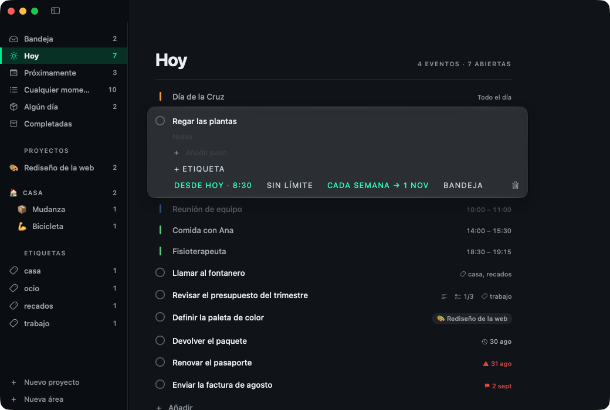
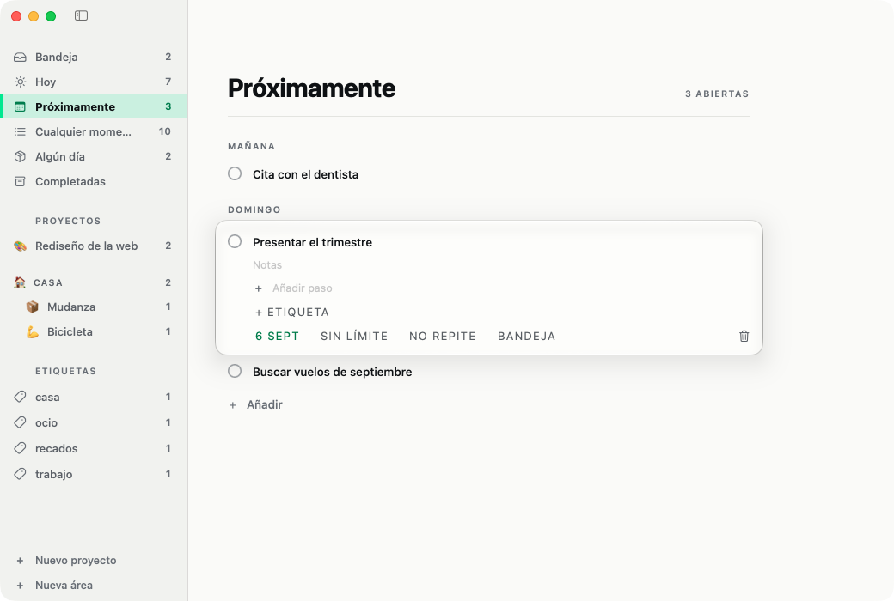

<div align="center">


<h1>Pauta</h1>

<p><strong>Gestor de tareas para macOS.</strong><br>
Nativo en SwiftUI, sin cuentas, sin suscripción<br>
y con tus datos en tu propia carpeta de iCloud.</p>

<p>


</p>



<p><em>Hoy es el día completo: lo que hay que hacer y lo que ya está comprometido,<br>
en el orden en que va a ocurrir.</em></p>

</div>

Pauta organiza el trabajo en dos ejes: **cuándo** y **de qué**. Una tarea entra
por la bandeja sin que tengas que decidir nada más que el título. Desde ahí le
pones fecha —y aparece en Hoy o en Próximamente—, la aparcas en Algún día, o la
metes en un proyecto.

Las listas de la barra lateral no son carpetas: son **consultas** sobre ese
estado. Una tarea con fecha de hoy que pertenece a un proyecto sale a la vez en
Hoy, en Cualquier momento y en su proyecto, sin duplicarse. Cambiar su fecha la
mueve de lista sola.

## Las listas

| Lista | Qué contiene |
|---|---|
| Bandeja | Sin fecha, sin proyecto y sin aparcar: lo que aún no has decidido |
| Hoy | Planificadas para hoy o antes, más lo que tenga la **fecha límite encima**. Una tarea vencida sigue apareciendo aquí |
| Próximamente | Planificadas para más adelante, **agrupadas por día** |
| Cualquier momento | Lo que se puede hacer ya: Hoy más las tareas de proyecto sin fecha. La bandeja queda fuera: lo que hay allí aún está sin decidir |
| Algún día | Aparcadas a propósito, sin fecha |
| Completadas | Lo hecho, lo más reciente primero |

Los **proyectos** aparecen debajo, cada uno con su cuenta de tareas abiertas.

Una tarea de proyecto sin fecha sale en `Cualquier momento` a propósito: meterla
en un proyecto ya es decidir que se va a hacer, solo falta cuándo. Fuera de su
propio proyecto, cada tarea lleva el nombre del proyecto —con su emoji— en una
pastilla a la derecha, que es lo que permite distinguir dos tareas que se llamen
igual.

«Sin fecha» y «Algún día» son estados distintos, y esa distinción es el centro
del modelo: el primero significa «todavía no lo he decidido» y deja la tarea en
la bandeja; el segundo, «lo quiero hacer, pero no ahora». Por eso ponerle fecha
a una tarea aparcada la saca de Algún día — estar aparcada y con fecha a la vez
sería contradictorio.

<div align="center">

<p><em>Próximamente agrupa por día. La app sigue el tema del sistema.</em></p>
</div>

## Cómo se usa

| Atajo | Acción |
|---|---|
| `⌘N` | Nueva tarea en la lista actual |
| `⌘⇧N` | Nuevo proyecto |
| `⌘⌥N` | Nueva área |
| `↩` | Guardar y seguir escribiendo otra tarea |
| `esc` | Cancelar la tarea nueva |
| `⌘⇧R` | Importar de Recordatorios |
| `⌘1` … `⌘6` | Bandeja / Hoy / Próximamente / Cualquier momento / Algún día / Completadas |

Una tarea nueva nace ya encajada en la lista donde la creas: en Hoy sale con la
fecha de hoy, en Próximamente con la de mañana, en Algún día aparcada, y dentro
de un proyecto asignada a él.

Clic en una tarea la despliega para editar título, notas, fecha, repetición y
proyecto; se guarda mientras escribes, sin botón de guardar. El menú de fecha
tiene atajos para hoy, mañana y la semana que viene, y **«Otra fecha…» abre un
calendario** para cualquier día. El calendario es propio y no el `DatePicker`
gráfico del sistema, que traía su caja, su tipografía y su azul, y aquí se veía
diminuto y prestado. Este usa la paleta y los rótulos del resto de la interfaz,
marca hoy con un perfil y el día elegido con relleno, y siempre dibuja seis
semanas para que el panel no encoja al cambiar de mes. Clic derecho abre las acciones
rápidas: programar, aparcar o eliminar.

**Arrastrar** hace dos cosas según dónde sueltes:

- Sobre una **lista de la barra lateral**, mueve la tarea a esa lista. Como las
  listas son consultas y no carpetas, mover es cambiar lo que hace que la tarea
  caiga ahí: a `Hoy` le pone la fecha de hoy, a `Algún día` la aparca, a la
  bandeja le quita fecha y proyecto. Dos detalles: a `Próximamente` se respeta una
  fecha futura que ya tuviera en vez de adelantarla a mañana, y arrastrar una
  completada a una lista de pendientes la reabre — si no, iría a un sitio donde no
  se ve y parecería perdida.
- Sobre **otra tarea**, la coloca justo antes: es la prioridad manual. Una línea
  marca dónde va a caer. Soltar sobre «Añadir» la manda al final.
- Sobre una tarea **de otro día en `Próximamente`**, además le pone ese día. Esa
  lista está agrupada por fecha, así que la fila que señalas dice dos cosas y no
  una, y cambiar solo la prioridad hacía que el gesto pareciera no hacer nada:
  la tarea se quedaba donde estaba. También se puede soltar sobre el **rótulo del
  día**, que la manda a la cabeza de ese día.
- **Los proyectos también se arrastran entre ellos** para ordenar la barra
  lateral, y **sobre un área** para meterlos en ella. Sobre el rótulo
  `PROYECTOS` vuelven a quedarse sueltos.
- **Las áreas se arrastran entre ellas** para ordenarlas.

Una misma fila recibe cosas distintas, así que la señal cambia según lo que
lleves: **línea de inserción** cuando es reordenar entre iguales, y **la fila
entera encendida** cuando es meter algo dentro. Son gestos que caen en el mismo
sitio y no deben parecer el mismo.

Pasando el cursor por el rótulo `PROYECTOS` aparece **«A–Z»**, que ordena áreas
y proyectos alfabéticamente; también está en el menú contextual de cualquiera de
los dos. Es el alfabético del idioma, no el de los códigos: la ñ va tras la n y
los acentos cuentan como su letra. Los proyectos se ordenan **dentro de su
grupo**, que es como se leen. Solo aparece con el cursor encima porque ordenar
es algo que se hace de año en año.

### Áreas

Un área es un cajón de proyectos: «Casa», «Trabajo», «Estudios». Al pincharla
enseña **todo lo pendiente de sus proyectos**, con la pastilla del proyecto en
cada tarea para saber de dónde sale cada una.

Un área **no guarda tareas propias**. Lo que agrupa son proyectos, así que sin
proyecto no habría a qué colgarlas, y una tarea suelta dentro de un área sería
un segundo padre con sus propias reglas en un modelo que ya tiene uno. Por eso
estando en un área no aparece el botón de añadir y `⌘N` crea en la bandeja, que
es donde va lo que aún no está decidido.

Borrar un área **no borra sus proyectos**: los deja sueltos. Agrupar no es
contener, y perder el trabajo de dentro por tirar el cajón sería una pérdida
difícil de deshacer.

El rótulo `PROYECTOS` se muestra aunque no haya ninguno suelto: es el sitio
donde se sueltan para sacarlos de un área, y sin él no habría forma de sacarlos
arrastrando.

La prioridad es **una sola para toda la app**, no una por lista: las listas son
consultas sobre la misma tarea, así que su prioridad es intrínseca y todas la
respetan. En `Próximamente` manda el día, y el orden manual solo ordena dentro de
cada día.

Pegar un texto de varias líneas en el campo de nueva tarea **pregunta qué
quieres**: tantas tareas como líneas, o una sola tarea con el resto como pasos.
Las dos lecturas son razonables y ninguna es obviamente la buena, así que decidir
por ti acertaría la mitad de las veces. En ambos casos se quitan las viñetas
(`*`, `-`, `•`) y la numeración.

### Los eventos del día

`Hoy` enseña también **los eventos de tu calendario**, para que sea el día
completo y no solo la lista de tareas: lo que hay que hacer y lo que ya está
comprometido, en el orden en que va a ocurrir. Lo de todo el día enmarca la
jornada y va arriba; después, todo lo que tiene hora —da igual si es un evento o
una tarea— y por último lo que no tiene hora, en su orden manual. Un evento ya
terminado se apaga: sigue siendo parte del día, pero ya no pide nada.

Se leen y no se tocan: sin casilla, sin arrastre y sin editor. La casilla es la
promesa de que algo se puede completar, y un evento no se completa — se pasa. La
franja de color es la del calendario del que viene, que es como se distingue de
un vistazo el trabajo de lo demás.

**Los eventos no entran en el `Store`.** Si entraran, acabarían escritos en la
carpeta como copias del calendario de verdad, y dos copias de lo mismo terminan
discrepando: se edita el evento fuera y aquí queda la versión vieja para
siempre. La fuente es el calendario; esto es lo que se lee de él cada vez, y se
relee solo cuando el sistema avisa de que algo cambió. Tampoco se hace al revés
—escribir las tareas de Pauta como eventos—: duplicaría cada tarea en dos sitios
que se editan por separado y hay que reconciliar.

El permiso se ofrece **una vez**, con una línea discreta en `Hoy`. Si dices que
no, no se vuelve a preguntar desde ahí; queda el comando *Eventos del
calendario…*, que lleva a los ajustes del sistema. Y no se cuentan como tareas:
el rótulo dice «4 EVENTOS · 7 ABIERTAS», porque un evento no es algo que hacer.

```bash
./build/Pauta.app/Contents/MacOS/Pauta --eventos
```

### Lo que no se hizo a tiempo

Nada se pierde ni se queda atrás: una tarea planificada para un día que ya pasó
**sigue en `Hoy`**, día tras día, hasta que se haga o se replanifique. No se
mueve sola a hoy, porque su fecha original es información: dice cuánto llevas
arrastrándola.

Y lo dice: junto a la tarea aparece **el día para el que se planificó**, en gris
y con un icono de reloj. Sin eso, algo de hace tres días se leería igual que
algo de esta mañana. Va en gris y no en rojo a propósito — el rojo es de las
fechas límite, que son lo que de verdad aprieta; si todo gritara, nada diría
nada.

Lo atrasado **insiste**: vuelve a avisar a su hora, hoy mismo si aún no ha
llegado y mañana si ya pasó, y así cada día hasta que se haga. El aviso dice
desde cuándo —«Pendiente desde el 31 de agosto»— con la fecha escrita entera y
no «hace tres días», porque se escribe hoy y puede sonar mañana. Completarla es
lo único que lo calla, que es la única forma sensata de callarlo.

Solo insiste lo de hoy y lo atrasado. Una tarea de la semana que viene avisa el
día que le toca, no todos los días desde hoy.

Con las repetitivas hay una trampa. La siguiente se cuenta desde la fecha que
tenía, no desde hoy, para que una semanal completada con un día de retraso siga
cayendo en su día de la semana. Pero además **se avanza hasta pasar de hoy**: si
no, completar una diaria con tres días de retraso pariría una sucesora ya
vencida, y habría que completarla tantas veces como días de retraso llevara solo
para ponerse al día — la app pidiendo cuentas por unos días que ya pasaron. Y si
la serie terminó mientras la tarea estaba atrasada, no nace ninguna: ponerse al
día no revive una serie acabada.

### La hora

Toda fecha en Pauta es **un día**, normalizado a las 00:00; la hora es lo único
que mira el reloj. Se pone desde el propio menú de fecha —`Hora ▸`—, no desde un
control aparte: una hora sin día no significa nada, así que ponérsela a algo sin
fecha lo programa para hoy, y quitarle la fecha o aparcarlo se lleva la hora.

Va en un campo aparte y **no dentro de `when`**. `when` es un día y hay quince
sitios que lo normalizan para comparar, agrupar y ordenar; meterle una hora
dentro le daría dos significados al mismo campo, y la cuenta de la repetición
—que devuelve el arranque del día siguiente— la perdería en silencio. Un campo
aparte no se puede perder sin que se note.

En `Hoy` y en cada día de `Próximamente`, **lo que tiene hora va primero y por
hora**; debajo sigue mandando el orden manual. La hora gana a la prioridad
porque no es una preferencia sino una restricción de fuera: no puedes decidir
que las nueve van después de las seis. En un proyecto o en la bandeja no se
aplica, que ahí comparar horas de días distintos no diría nada.

Una repetitiva **hereda la hora** —y las etiquetas, y los pasos, estos sin
marcar—: «todos los días a las nueve» exige que la segunda vuelta también sean
las nueve.

#### El aviso

Una hora sin aviso sería una etiqueta, así que las tareas con hora avisan por el
sistema. El permiso se pide **la primera vez que hay algo que avisar**, no al
arrancar: quien no use horas no tiene por qué ver el diálogo. Si lo rechazas, la
hora sigue funcionando como orden y como rótulo, solo que muda.

Los avisos se **reconstruyen enteros** con cada cambio, en vez de irse añadiendo
y quitando uno a uno. Es más trabajo por cambio y muchísimo menos que razonar
sobre qué aviso quedó suelto de una tarea que se completó, cambió de día, se
borró o llegó de otro dispositivo. Se reprograma un segundo después del último
cambio, porque escribir un título cambia las tareas en cada tecla.

Hay un tope de **60**: el sistema descarta lo que pase de 64 por app, y sin tope
propio se perderían avisos sin decirlo. Se quedan los más cercanos.

Es la API vigente, `UNUserNotificationCenter` con un disparador de calendario —
`NSUserNotification` está obsoleta desde macOS 11. El disparador **no se repite**
aunque la tarea sí: la sucesora nace al completar la anterior y trae su propio
aviso, mientras que un disparador repetitivo seguiría sonando después de que la
serie hubiera acabado.

Hay un delegado, y hace falta para dos cosas que sin él no ocurren:

- **El aviso se ve aunque Pauta esté delante.** El sistema lo silencia por
  defecto dando por hecho que ya estás mirando la app, y en una app de tareas ese
  es justo el momento en que más falta hace.
- **Pulsarlo abre la tarea**, en una lista donde se vea; y trae un botón
  **«Completar»** para despachar una rutina sin abrir nada.

Y si el permiso está denegado, **la app lo dice**: una franja arriba de la lista,
con un atajo a los ajustes del sistema. Un aviso que no llega y se calla es peor
que no tener avisos, porque la tarea parece cubierta y no lo está.

```bash
./build/Pauta.app/Contents/MacOS/Pauta --avisos
```

### Listas de comprobación

Una tarea puede llevar pasos. Se ven al desplegarla, y en la fila cerrada aparece
la cuenta —`1/3`—, que se pone en verde solo cuando está entera: si toda cuenta
gritara, ninguna diría nada.

Son **pasos, no subtareas**: no tienen fecha, ni proyecto, ni prioridad propia.
Lo que se planifica sigue siendo la tarea; los pasos solo dicen por dónde va. Por
eso completar la tarea no los marca —si la reabres, la lista sigue donde estaba—
y vaciar el texto de un paso lo borra, porque un paso sin texto no dice nada.

El campo «Añadir paso» está siempre mientras la fila esté abierta: es lo que hace
descubrible que una tarea puede ser una lista.

### Etiquetas

Transversales a todo lo demás: una tarea puede llevar varias, y cada una es una
lista más en la barra lateral. Soltar una tarea sobre una etiqueta **se la añade
sin quitarle las otras** — a diferencia de las listas, las etiquetas no son
excluyentes. Una tarea creada dentro de una etiqueta nace con ella puesta.

`Casa` y `casa` son la misma, y los espacios de sobra se recortan. En cada fila
solo se muestran las etiquetas que la lista no da ya por sabidas: dentro de
`casa`, esa no se repite en cada línea.

Las etiquetas **salen de las tareas**, no de una lista aparte: existen mientras
algo pendiente las lleve, así que no quedan huérfanas que limpiar. El precio es
que renombrar una toca todas las tareas que la llevan; a cambio no hay una
entidad más que mantener viva. Renombrar y quitar están en su menú contextual.

Cada proyecto puede llevar un emoji: se elige pulsando el círculo junto a su
título, de una paleta corta, y sustituye a su símbolo en la barra lateral.

## Captura desde Recordatorios

Recordatorios de Apple sincroniza por iCloud y funciona con Siri, así que hace
de bandeja de entrada remota: lo que apuntes en el iPhone aparece en Pauta sin
necesidad de una app de iOS.

La app usa **una lista propia llamada «Pauta»**, que crea al arrancar si no
existe, y nunca toca tus otras listas. Al importar, cada recordatorio entra en la
bandeja y **se marca completado en Recordatorios**, para que fluya en vez de
acumularse. Cada tarea guarda el identificador de origen, así que si el marcado
fallara no se duplicaría en la siguiente importación.

Se importa al arrancar la app y con `⌘⇧R`. El permiso se pide la primera vez; si
lo deniegas, la app funciona igual sin la captura remota. Ojo: **una vez
denegado, macOS no vuelve a preguntar** y hay que activarlo a mano en Ajustes →
Privacidad y seguridad → Recordatorios.

```bash
./build/Pauta.app/Contents/MacOS/Pauta --reminders-status
./build/Pauta.app/Contents/MacOS/Pauta --import-reminders
./build/Pauta.app/Contents/MacOS/Pauta --seed-reminder "Título"
```

Diagnóstico, importación manual y siembra de un recordatorio para probar la
integración sin tocar el iPhone. Requieren que el permiso ya esté concedido: TCC
no puede presentar su diálogo en un proceso lanzado desde el terminal, porque
atribuye la petición al proceso responsable, que es la consola.

Escribir tareas de Pauta como recordatorios, en cambio, no está previsto: duplica
y obliga a resolver conflictos en los dos lados.

## Fechas límite

Una cosa es **cuándo pienso ponerme** (la fecha de planificación) y otra **cuándo
tiene que estar** (la fecha límite). Son campos distintos: se puede tener una
entrega el viernes sin haber decidido aún qué día ponerse, y esa tarea se queda en
la bandeja hasta que lo decidas.

Pero una fecha límite que no avisa no sirve de nada, así que **cuando vence
arrastra la tarea a `Hoy`** aunque no estuviera planificada. Lo aparcado en `Algún
día` se respeta: aparcarlo fue una decisión explícita.

En la lista, la fecha límite se muestra a la derecha: apagada mientras queda
margen, y en rojo con un triángulo cuando es hoy o ya pasó. En rojo solo cuando
aprieta — si todas gritaran, ninguna diría nada. Al completar la tarea el aviso se
apaga: ya no hay nada que entregar.

## Tareas repetitivas

Una tarea puede repetirse cada día, semana, mes o año. Al **completarla**, la
completada se queda en el historial y **nace la siguiente** con la fecha
avanzada, heredando notas y proyecto.

Esa es la decisión que importa: la alternativa —mover la misma tarea hacia
adelante— dejaría sin rastro de lo hecho, que es justo lo que uno quiere ver de
una rutina.

La siguiente fecha se cuenta **desde el día que tenía asignado, no desde hoy**:
completar tarde una tarea semanal no debe desplazarle el día para siempre.

Y descompletar retira la sucesora si nadie la ha tocado, porque marcar y desmarcar
acumularía copias. Por eso cada sucesora recuerda de cuál nació.

### Desde cuándo y hasta cuándo

**El inicio no es un campo aparte: es la fecha de la tarea.** Una semanal puesta
para el 1 de septiembre empieza ahí. Guardarlo dos veces solo daría ocasión de que
los dos valores discreparan, así que en una tarea repetitiva la fecha se muestra
como «Desde el 1 sept», que es lo que ya significaba.

**El fin sí es un campo**, y es opcional: `recurrenceEnd`, con `nil` para lo que
no acaba nunca, que es el caso normal. Cuando la siguiente repetición caería más
allá de esa fecha, la última se completa y no nace ninguna más. Las sucesoras
heredan el fin — si no, la serie volvería a ser infinita en la segunda vuelta.

Quitar la repetición borra también su fin: un «hasta» sin repetición no significa
nada.

## Barra de menús

El monograma junto al reloj abre un panel con las tareas de Hoy: completarlas
con su casilla, añadir una nueva (que cae en Hoy) y reabrir la ventana
principal, todo sin cambiar de app. Cubre casi todo lo que daría un widget sin
necesitar extensión ni firma — WidgetKit exige un `.appex` embebido que no encaja
con el empaquetado actual por SwiftPM y firma ad-hoc.

## Compilar y ejecutar

```bash
./run.sh
```

Compila y abre la app. Solo `./build.sh` genera `build/Pauta.app` sin lanzarla —
puedes arrastrarla a `/Applications` cuando te guste cómo va.

```bash
swift test
```

Los tests cubren `PautaCore`, que no depende de la interfaz.

### Firma

`build.sh` firma con la primera identidad «Apple Development» del llavero que no
esté revocada, o con la que fuerces en `SIGN_ID`. Si no encuentra ninguna, cae a
firma ad-hoc y lo avisa.

No es un detalle cosmético. Con firma ad-hoc el hash del binario cambia con cada
cambio de código, y TCC —el sistema de permisos— identifica las apps por su
firma: cada build sería una app nueva para el sistema, así que los permisos de
calendario, recordatorios o accesibilidad se pedirían otra vez en cada
compilación, dejando entradas basura en Ajustes de Privacidad.

Con una identidad de desarrollador el requisito designado pasa a basarse en el
identificador y el certificado:

```
designated => identifier "dev.jadrdev.pauta" and anchor apple generic
              and certificate leaf[subject.CN] = "Apple Development: …"
```

Comprobado: tras un cambio real de código el `cdhash` cambia y ese requisito no,
así que los permisos concedidos sobreviven a las recompilaciones. Esto es lo que
desbloquea las integraciones con Calendario y Recordatorios.

La letra pequeña: los certificados «Apple Development» caducan (el actual, en
mayo de 2027). Cuando caduque habrá que renovarlo y volver a conceder permisos.

No hace falta abrir Xcode, pero sí tenerlo instalado: los scripts usan
`DEVELOPER_DIR=/Applications/Xcode-beta.app/Contents/Developer` porque
`xcode-select` de este equipo apunta a las Command Line Tools. Si algún día
cambias eso (`sudo xcode-select -s /Applications/Xcode-beta.app`), los scripts
siguen funcionando.

## Dónde se guardan los datos

**Un archivo JSON por objeto**, con escritura atómica, en iCloud Drive:

```
~/Library/Mobile Documents/com~apple~CloudDocs/Pauta/
  items/<uuid>.json
  projects/<uuid>.json
```

Si iCloud Drive no está activo, la app usa `~/Library/Application Support/Pauta/`
con la misma estructura y funciona igual, solo sin sincronizar. Al estrenar la
carpeta de iCloud adopta lo que hubiera en la local, y deja el original intacto
como respaldo.

No se usa `url(forUbiquityContainerIdentifier:)`: esa vía exige entitlements y un
perfil de aprovisionamiento embebido, que no encajan con un bundle montado a
mano. iCloud Drive es una carpeta normal y la app no está en sandbox, así que
escribe en ella directamente.

### Por qué no hay cuentas

Pauta no tiene registro ni inicio de sesión, y no es un descuido: **no hay a
dónde entrar**. Un login solo significa algo si hay un servidor que guarda tus
datos o una suscripción que comprobar, y aquí no hay ninguna de las dos. Los
datos son tuyos, están en tu carpeta, y la cuenta que los sincroniza ya existe:
es la Apple Account de tu iCloud. Añadir otra sería una segunda identidad para
la misma persona, y la app tendría que decidir qué hacer cuando las dos no
coincidan.

Las reglas de la App Store empujan en esa misma dirección. La 5.1.1(v) dice que
una app no puede exigir cuenta para funciones que no dependen de una cuenta, así
que una pantalla de registro delante de un gestor de tareas local es más
probable que se rechace a que se pida. Y si algún día se ofreciera un login de
terceros —Google, por ejemplo—, la 4.8 obliga a ofrecer también una alternativa
equivalente que no recopile datos, que es justo lo que hace *Iniciar sesión con
Apple*: Google a secas no sería una opción.

Un login se justificaría el día que haya algo al otro lado: **compartir listas
con otra persona**, una versión web, sincronizar con algo que no sea Apple, o una
suscripción con derechos que verificar. Ni siquiera cobrar por la app lo exige —
de eso ya se encarga el recibo de compra. Si llega, lo razonable es *Iniciar
sesión con Apple* y como **llave de lo compartido, nunca como puerta de entrada**:
la app tiene que seguir abriéndose y funcionando entera sin identificarse.

### Lo que sí costaría publicarla

El trabajo de llevarla a la App Store no son las cuentas, es el **sandbox**: allí
es obligatorio, y bajo sandbox la ruta de ahora
—`~/Library/Mobile Documents/com~apple~CloudDocs/Pauta/`— deja de ser accesible.
Habría que pasar al contenedor de iCloud de verdad, con sus entitlements y su
perfil, que es exactamente lo que este montaje evitaba. Con `NSUbiquitousContainers`
la carpeta sigue viéndose en iCloud Drive, así que no se pierde nada de cara al
usuario, pero **la ruta cambia** y los datos hay que mudarlos.

Lo bueno es que esa mudanza ya está resuelta: `adoptData(from:to:)` es lo que hace
hoy al estrenar la carpeta de iCloud —copia lo que hubiera en la local y deja el
original como respaldo—, y sirve igual para el salto al contenedor. Lo demás es
fontanería conocida: proyecto de Xcode en vez del bundle a mano, firma de
distribución, notarización y las etiquetas de privacidad.

### Y si algún día se cobrara

La misma decisión que la de las cuentas, vista desde el otro lado: **ni por
número de proyectos ni por asiento**, sino una compra única.

Cobrar por cantidad —tantos proyectos, tantas tareas— es lo que primero se le
ocurre a cualquiera y es lo peor que le podría pasar a esta app. Castiga justo a
quien le está funcionando, que es el que ha metido su vida dentro, y lo hace en
el peor momento: cuando ya no puede volverse atrás sin dolor. Peor todavía,
cambia cómo se usa: con dos proyectos de margen se duda antes de crear uno, y un
gestor de tareas en el que dudas antes de apuntar algo ha dejado de hacer su
trabajo. Sería cobrar por empeorar el producto. Y hay algo que el usuario huele
aunque no sepa explicarlo: **los costes de aquí no crecen con sus proyectos**.
Sin servidor, el proyecto número cuarenta cuesta lo mismo que el primero, que es
cero.

Por asiento tampoco, mientras no haya equipo: sería cobrar por algo que no
existe. Pero el día que haya compartir, por asiento **es** lo correcto, y por
suscripción — porque ahí aparece por fin la única parte con coste real y
recurrente, y el precio sigue al coste. Que es lo mismo que pasa con el login:
[la cuenta y la suscripción llegan juntas o no llegan](#por-qué-no-hay-cuentas).

Mientras tanto, una compra única y el recibo de la App Store como única llave:
no hay nada que se pueda dejar de pagar porque no hay nada que haya que seguir
pagando. Con prueba de verdad y no con recortes — nadie muda su vida a un gestor
de tareas por una captura de pantalla, hay que vivir con él una semana: gratis y
completa ese tiempo, y luego se paga para seguir. No se quitan funciones, se da
tiempo.

Si hicieran falta dos escalones, el corte honesto no es «tres proyectos o
ilimitados», es **«tu Mac» contra «tu vida en todos lados»**: macOS completo, y
la compra trae iPhone, widget e integraciones. Ese límite se entiende sin
explicarlo, y encima es el que de verdad cuesta mantener.

Y una regla para entonces: **sin servidor, se cobra por versión mayor y no por
mes**. Es lo único que paga el mantenimiento sin pedirle a nadie que alquile algo
que no cuesta nada.

Copiar la carpeta es la copia de seguridad; borrarla deja la app a cero. Para ver
el estado guardado sin abrir la interfaz:

```bash
./build/Pauta.app/Contents/MacOS/Pauta --dump
```

### Por qué un archivo por objeto

Antes era un único `data.json` con todo. Esa forma es la peor posible para
sincronizar: dos dispositivos que añaden **tareas distintas** escriben versiones
incompatibles del mismo archivo, y una de las dos tareas se pierde en silencio.
No hace falta simultaneidad, basta que uno estuviera sin conexión un rato.

Con un archivo por objeto, tocar tareas distintas no genera ningún conflicto, y
un archivo corrupto solo se lleva su propia tarea en vez de todo el almacén.
Cada mutación escribe **solo el objeto tocado**: reescribir todo agitaría las
fechas de modificación de archivos intactos, que es justo lo que hace trabajar de
más a la sincronización.

Borrar **no elimina el archivo: deja una lápida** (`deletedAt`). Si se eliminara,
un dispositivo que no vio el borrado resucitaría la tarea al sincronizar.

Esa protección caduca: pasados **30 días** todos los dispositivos han
sincronizado y la lápida ya no protege de nada, así que su archivo se borra al
arrancar. Sin eso se acumularían para siempre, leyéndose en cada carga. El precio
es que un dispositivo apagado más de un mes podría resucitar lo que borraste.

Las **completadas no se borran nunca**: son tu historial, y eliminarlas solas
sería perder datos sin haberlo pedido. Si algún día molestan, lo suyo es un
comando manual, no una purga automática.

### El orden de la lista

Las fechas se guardan en ISO8601, cuya precisión máxima es el **milisegundo**.
Dos tareas creadas en el mismo milisegundo —pegar varias líneas, por ejemplo—
tendrían la misma fecha, y como `sorted` no garantiza estabilidad y el orden de
los archivos en el directorio es arbitrario, **la lista se reordenaría entre
arranques**.

Por eso hay dos medidas: al crear una tarea se fuerza que su fecha sea al menos
un milisegundo posterior a la última (lo que hay que preservar es el orden, no el
instante), y todos los ordenamientos usan `Item.byCreation`, que desempata por
identificador para ser un orden total.

La migración desde el `data.json` antiguo aplica lo mismo respetando el orden que
tenía el array, porque sus fechas solo tenían segundos y casi todas empataban.
El archivo original se conserva como respaldo; puedes borrarlo cuando compruebes
que todo está en su sitio.

### Sincronización

Dos cosas que iCloud impone y la app resuelve:

**Archivos desalojados.** Para ahorrar espacio, iCloud puede dejar un archivo sin
contenido local y sustituirlo por un marcador `.nombre.json.icloud`. Al cargar, la
app pide su descarga; es asíncrona, así que esa carga no lo verá pero la siguiente
sí. `--dump` avisa de cuántos quedan pendientes.

**Conflictos.** Cuando dos dispositivos tocan el mismo archivo, iCloud guarda las
versiones en conflicto en vez de elegir. La app se queda con la de `updatedAt` más
reciente y marca las demás como resueltas — si no se marcaran, el conflicto se
quedaría ahí para siempre. Que la decisión salga del contenido del archivo y no de
su fecha en disco la hace determinista: los dos dispositivos eligen lo mismo.

**Refresco en vivo.** La app vigila la carpeta con FSEvents y recarga cuando algo
cambia, así que lo que llegue de otro dispositivo aparece sin reabrirla. Se usa
FSEvents y no `DispatchSource.makeFileSystemObjectSource`: este último solo se
entera de altas y bajas de entradas en un directorio, no de que cambie el
contenido de un archivo que ya existía — que es justo lo que hace iCloud al traer
una edición remota.

La recarga es **idempotente**: si lo leído coincide con lo cargado, no toca nada.
Hace falta porque las escrituras de la propia app también disparan el vigilante,
y una recarga que reasignara en vano refrescaría la interfaz e interrumpiría la
edición en curso. Para que esa comparación funcione, las fechas se sellan ya
redondeadas al milisegundo, que es la precisión con la que se guardan: si no, el
valor en memoria nunca coincidiría con el del archivo y toda recarga parecería un
cambio.

**Y es incremental**: solo se abren los archivos que cambiaron. De cada uno se
recuerda su *sello* —fecha de modificación y tamaño— junto con lo que se leyó; si
el sello coincide, se reaprovecha lo de antes. El tamaño está en el sello porque
dos escrituras seguidas pueden caer en la misma fecha de modificación. Las claves
se piden en el propio listado del directorio, así que consultarlas no vuelve a
tocar el disco.

Importa porque el vigilante salta con **cualquier** escritura, incluidas las
nuestras: marcar una tarea como hecha releía la carpeta entera. Además, lo que se
acaba de escribir se anota en la caché en el momento de guardarlo, así que esa
recarga no abre ni un archivo. Con 500 tareas, veinte ciclos de escribir y
recargar pasan de 1,44 s a 0,12 s.

Preguntar por conflictos también se hace solo al releer un archivo, que era la
parte cara de la carga: un conflicto llega siempre acompañado de un cambio en el
archivo, así que no se pierde ninguno.

### Decodificación

Las tareas y los proyectos se leen con un `init(from:)` escrito a mano que usa
`decodeIfPresent` para todo. No es un capricho: el `Codable` sintetizado de Swift
usa `decode` para las propiedades no opcionales e **ignora sus valores por
defecto**, así que añadir un campo nuevo haría fallar la lectura de los archivos
ya guardados con un `keyNotFound`. Con el decodificador tolerante, los campos que
se añadan en el futuro no rompen los datos existentes.

## Diseño

Monograma «P» con check verde, sans geométrica, verde de marca sobre casi negro
azulado. Sigue el tema claro/oscuro del sistema.

- **Verde `#10E888`** como acento único. Marca la lista activa, los contadores y
  la casilla completada.
- **Iconos monocromos** en la barra lateral, un paso más tenues que la etiqueta,
  en verde solo cuando la fila está activa. El multicolor rompería el acento
  único. Los símbolos evitan chocar con otros significados de la interfaz: un
  check para Completadas competiría con la casilla de completar, y una estrella se
  lee como «favorito», no como «hoy» — de ahí el archivador y el sol.
- **Sin emojis** en las listas fijas: se renderizan distinto según el sistema,
  son multicolor y no alinean. En los proyectos del usuario sí, porque ahí la app
  no puede adivinar un símbolo.
- **Dos columnas de alineación** en la barra lateral: glifos a 15 pt y texto a 41
  (15 + 17 de columna de icono + 9 de espaciado). El rótulo de sección y el botón
  de nuevo proyecto respetan ambas.
- **La barra lateral va sin cabecera de marca.** El icono del Dock ya identifica
  la app; un logo dentro de su propia interfaz solo come espacio vertical. El
  lockup (`BrandMark` en `Theme.swift`) se mantiene sin usar, para un panel
  «Acerca de» o una pantalla de bienvenida.
- **Dos variantes del monograma** en `Resources`: `monogram.png` (P blanca, para
  fondo oscuro) y `monogram-ink.png` (P en negro de marca, para fondo claro).
  Cuando se muestre el lockup, el wordmark «PAUTA» se compone con tipografía y
  tracking en vez de traerse como PNG: nítido a cualquier tamaño y sigue el tema
  sin necesitar dos versiones.
- **Liquid Glass** en lo que se levanta de la página: el editor desplegado de una
  tarea. En macOS anterior a 26 cae a fondo sólido con filete.

### Contraste

El verde puro sobre fondo claro da **1.56** — ilegible. La paleta separa dos
tokens: `accent` para rellenos, bordes y fondos de selección, y `accentInk` para
cualquier cosa que sea texto (verde profundo `#097D49` en tema claro). El *tint*
de la app usa `accentInk`, porque los `Menu` sin borde colorean su etiqueta con
él e ignoran el `foregroundStyle`.

Los grises (`inkSoft`, `inkFaint`) se resolvieron numéricamente para pasar WCAG
AA (≥ 4.5) sobre los cuatro fondos. Si cambias un fondo, recalcúlalos.

## Iconos

`tools/make-icon.py` compone los `.icns` desde `Resources/monogram*.png`:

| Variante | Qué es |
|---|---|
| `icon-mono` | Monograma blanco sobre el negro de marca. **La que está puesta** |
| `icon-claro` | Monograma oscuro sobre fondo claro |

```bash
python3 tools/make-icon.py ambas
ICON=icon-claro ./build.sh
```

Al ser un monograma y no un wordmark, el mismo arte funciona de 16 a 1024 px sin
necesitar versiones distintas por tamaño.

### Limitación conocida del arte actual

El monograma se extrajo de un *mockup* con fondo, sombras y resplandor
incrustados, filtrando por color y quedándose con las componentes conexas
grandes. Funciona, pero a 512 px se aprecian dos defectos: una muesca en el brazo
de la P y un fragmento de la línea oscura que separa el check en el diseño
original — un detalle de tres colores que una extracción a dos no puede
representar. A tamaño de Dock (128 px) no se ven.

Con un SVG o un PNG a 1024+ con fondo transparente se regenera todo perfecto en
un comando: sustituye `Resources/monogram.png` y ejecuta `make-icon.py`.

## Modo maqueta

Para revisar el diseño sin tocar tus datos reales: arranca con tareas de muestra
en memoria, que no se escriben en disco, y permite forzar la apariencia.

```bash
./build/Pauta.app/Contents/MacOS/Pauta --demo --light
./build/Pauta.app/Contents/MacOS/Pauta --demo --dark --view 3
```

`--view 1…6` elige la lista de arranque, en el orden de la barra lateral.
Combinado con `--dump` inspecciona la maqueta en vez de los datos reales.

## Estructura

```
Sources/PautaCore/        librería sin UI: la compartirán widget/iOS/sync
  Models.swift            Item, ChecklistStep, Project, Area, Perspective
  Store.swift             estado + persistencia + consultas
  Avisos.swift            avisos del sistema para las tareas con hora
  Agenda.swift            eventos del calendario, solo de lectura
Sources/Pauta/            la app de macOS
  PautaApp.swift          punto de entrada, menús, atajos y barra de menús
  Views/Theme.swift       paleta, tipografía y filetes
  Views/SidebarView.swift barra lateral
  Views/ItemListView.swift lista y cabecera
  Views/ItemRowView.swift fila, casilla y editor desplegado (Liquid Glass)
  Views/MenuBarView.swift panel de la barra de menús
Tests/PautaCoreTests/     tests del núcleo (swift test)
```

## Qué falta (siguiente iteración)

- **Los eventos también en `Próximamente`**, que ya va agrupada por día y es
  donde encajarían sin inventar nada. Se dejó fuera para no cargar de golpe una
  ventana de semanas de calendario: primero conviene ver si en `Hoy` estorban o
  ayudan
- Widget y app de iOS — necesitan proyecto de Xcode y cuenta de desarrollador.
  `PautaCore` ya está extraído para ese salto, y la sincronización ya está
  hecha: la misma carpeta de iCloud le sirve a un iPhone sin tocar nada
